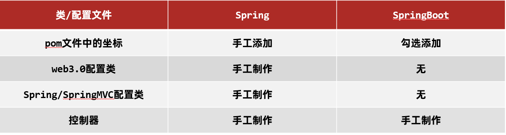
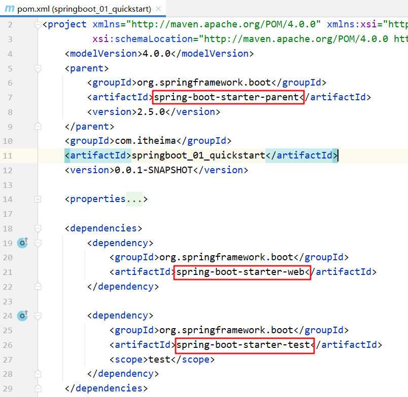
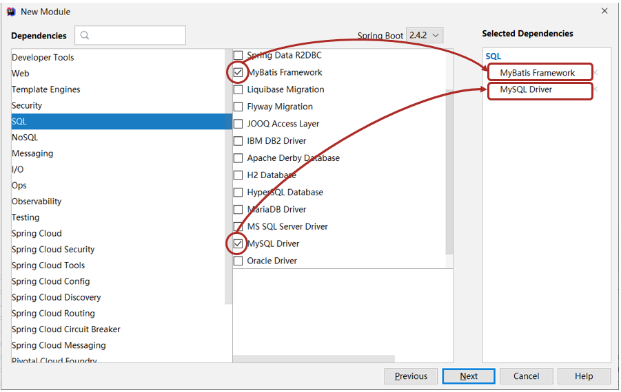

- [SpringBoot 笔记](#springboot-笔记)
- [1. SpringBoot 简介](#1-springboot-简介)
  - [1.1  创建 `Controller`](#11--创建-controller)
  - [1.2  对比](#12--对比)
  - [1.3 SpringBoot 打包](#13-springboot-打包)
  - [1.4 SpringBoot 概述](#14-springboot-概述)
    - [1.4.1 起步依赖](#141-起步依赖)
    - [1.4.2 小结](#142-小结)
    - [1.4.3  程序启动](#143--程序启动)
- [2. 配置文件](#2-配置文件)
  - [2.1 不同配置文件](#21-不同配置文件)
  - [2.2 配置文件优先级](#22-配置文件优先级)
  - [2.3  yaml格式](#23--yaml格式)
    - [2.3.1 语法规则](#231-语法规则)
  - [2.4 yaml 配置文件数据读取](#24-yaml-配置文件数据读取)
    - [2.4.1 环境准备](#241-环境准备)
    - [2.4.2 读取配置数据](#242-读取配置数据)
      - [使用 @Value 注解](#使用-value-注解)
      - [Environment 对象](#environment-对象)
      - [自定义对象](#自定义对象)
  - [2.5 多环境配置](#25-多环境配置)
    - [2.5.1 yaml 文件](#251-yaml-文件)
    - [2.5.2 properties 文件](#252-properties-文件)
    - [2.5.3  命令行启动参数设置](#253--命令行启动参数设置)
  - [2.6 配置文件分类](#26-配置文件分类)
- [3. SpringBoot 整合 Junit](#3-springboot-整合-junit)
- [4. SpringBoot整合mybatis](#4-springboot整合mybatis)
  - [4.1 使用 Druid 数据源](#41-使用-druid-数据源)

# SpringBoot 笔记

# 1. SpringBoot 简介

`SpringBoot`  是由  `Pivotal`  团队提供的全新框架，其设计目的是用来==简化==  `Spring`  应用的==初始搭建==以及==开发过程==。 

> ==注意：==
>
> 1. 在创建好的工程中不需要创建配置类
>
> 2. 创建好的项目会自动生成其他的一些文件，而这些文件目前对我们来说没有任何作用，所以可以将这些文件删除。
>
>    可以删除的目录和文件如下：
>
>    * `.mvn`	
>    * `.gitignore`
>    * `HELP.md`
>    * `mvnw`
>    * `mvnw.cmd`

## 1.1  创建 `Controller`

在  `com.itheima.controller` 包下创建 `BookController` ，代码如下：

```java
@RestController
@RequestMapping("/books")
public class BookController {

    @GetMapping("/{id}")
    public String getById(@PathVariable Integer id){
        System.out.println("id ==> "+id);
        return "hello , spring boot!";
    }
}
```

**启动服务器**

运行  `SpringBoot`  工程不需要使用本地的  `Tomcat`  和 插件，只运行项目  `com.itheima`  包下的 `Application`  类，我们就可以在控制台看出如下信息。

## 1.2  对比

做完 `SpringBoot` 的入门案例后，接下来对比一下 `Spring` 程序和 `SpringBoot` 程序。如下图



* **坐标**

  `Spring`  程序中的坐标需要自己编写，而且坐标非常多

  `SpringBoot`  程序中的坐标是我们在创建工程时进行勾选自动生成的

* **web3.0 配置类**

  `Spring`  程序需要自己编写这个配置类。这个配置类大家之前编写过，肯定感觉很复杂

  `SpringBoot`  程序不需要我们自己书写

* **配置类**

  `Spring/SpringMVC`  程序的配置类需要自己书写。而  `SpringBoot`   程序则不需要书写。

> ==注意：基于Idea的  `Spring Initializr`  快速构建  `SpringBoot`  工程时需要联网。== 

## 1.3 SpringBoot 打包

​		后端可以将 `SpringBoot` 工程打成 `jar` 包，该 `jar` 包运行不依赖于 `Tomcat` 和 `Idea` 这些工具也可以正常运行，只是这个 `jar` 包在运行过程中连接和我们自己程序相同的 `Mysql` 数据库即可。这样就可以解决这个问题，如下图


由于我们在构建 `SpringBoot` 工程时已经在 `pom.xml` 中配置了如下插件

```xml
<plugin>
    <groupId>org.springframework.boot</groupId>
    <artifactId>spring-boot-maven-plugin</artifactId>
</plugin>
```

所以我们只需要使用 `Maven` 的 `package` 指令打包就会在 `target` 目录下生成对应的 `Jar` 包。

> ==注意：该插件必须配置，不然打好的 `jar` 包也是有问题的。==

**启动**

进入 `jar` 包所在位置，在 `命令提示符` 中输入如下命令

```shell
jar -jar springboot_01_quickstart-0.0.1-SNAPSHOT.jar
```

## 1.4 SpringBoot 概述

原始  `Spring`  环境搭建和开发存在以下问题：

* 配置繁琐
* 依赖设置繁琐

`SpringBoot`  程序优点恰巧就是针对  `Spring`  的缺点

* 自动配置。这个是用来解决  `Spring`  程序配置繁琐的问题
* 起步依赖。这个是用来解决  `Spring ` 程序依赖设置繁琐的问题
* 辅助功能（内置服务器，...）。我们在启动  `SpringBoot`  程序时既没有使用本地的 ` tomcat`  也没有使用  `tomcat`  插件，而是使用  `SpringBoot`  内置的服务器。

### 1.4.1 起步依赖

我们使用 `Spring Initializr`  方式创建的 `Maven` 工程的的 `pom.xml` 配置文件中自动生成了很多包含 `starter` 的依赖，如下图



这些依赖就是==启动依赖==

`dependencyManagement` 标签是进行依赖版本锁定，但是并没有导入对应的依赖；如果我们工程需要那个依赖只需要引入依赖的 `groupid` 和 `artifactId` 不需要定义 `version`。

### 1.4.2 小结

**starter**

* `SpringBoot` 中常见项目名称，定义了当前项目使用的所有项目坐标，以达到减少依赖配置的目的

**parent**

* 所有 `SpringBoot` 项目要继承的项目，定义了若干个坐标版本号（依赖管理，而非依赖），以达到减少依赖冲突的目的

* `spring-boot-starter-parent`（2.5.0）与 `spring-boot-starter-parent`（2.4.6）共计57处坐标版本不同

**实际开发**

* 使用任意坐标时，仅书写GAV中的G和A，V由SpringBoot提供

  > G：groupid
  >
  > A：artifactId
  >
  > V：version

* 如发生坐标错误，再指定version（要小心版本冲突）

### 1.4.3  程序启动

创建的每一个 `SpringBoot` 程序时都包含一个类似于下面的类，我们将这个类称作引导类

```java
@SpringBootApplication
public class Springboot01QuickstartApplication {
    
    public static void main(String[] args) {
        SpringApplication.run(Springboot01QuickstartApplication.class, args);
    }
}
```

==注意：==

* `SpringBoot` 在创建项目时，采用 jar 的打包方式

* `SpringBoot` 的引导类是项目的入口，运行  `main`  方法就可以启动项目

  因为我们在 `pom.xml` 中配置了 `spring-boot-starter-web` 依赖，而该依赖通过前面的学习知道它依赖 `tomcat` ，所以运行 `main` 方法就可以使用 `tomcat` 启动咱们的工程。

​	  现在我们启动工程使用的是 `tomcat` 服务器，那能不能不使用 `tomcat` 而使用 `jetty` 服务器，`jetty` 在我们 `maven` 高级时讲 `maven` 私服使用的服务器。而要切换 `web` 服务器就需要将默认的 `tomcat` 服务器给排除掉，怎么排除呢？使用 `exclusion` 标签

**小结：**

​	  通过切换服务器，我们不难发现在使用 `SpringBoot` 换技术时只需要导入该技术的起步依赖即可。

# 2. 配置文件

`SpringBoot` 提供了多种属性配置方式

* `application.properties`

  ```
  server.port=80
  ```

* `application.yml`

  ```yaml
  server:
  	port: 81
  ```

* `application.yaml`

  ```yaml
  server:
  	port: 82
  ```

> ==注意：`SpringBoot` 程序的配置文件名必须是 `application` ，只是后缀名不同而已。==

## 2.1 不同配置文件

- `application.properties` 配置文件内容如下：

```properties
server.port=80
```

* **application.yml配置文件**

删除 `application.properties` 配置文件中的内容。在 `resources` 下创建一个名为 `application.yml` 的配置文件，在该文件中书写端口号的配置项，格式如下：

```yaml
server:
	port: 81
```

> ==注意： 在`:`后，数据前一定要加空格。==

* **application.yaml配置文件**

删除 `application.yml` 配置文件和 `application.properties` 配置文件内容，然后在 `resources` 下创建名为 `application.yaml` 的配置文件，配置内容和后缀名为 `yml` 的配置文件中的内容相同，只是使用了不同的后缀名而已

`application.yaml` 配置文件内容如下：

```yaml
server:
	port: 83
```

## 2.2 配置文件优先级

三种配置文件的优先级是：

==`application.properties`  >  `application.yml`   >  `application.yaml`==

> ==注意：==
>
> * `SpringBoot` 核心配置文件名为 `application`
>
> * `SpringBoot` 内置属性过多，且所有属性集中在一起修改，在使用时，通过提示键 + 关键字修改属性
>
>   例如要设置日志的级别时，可以在配置文件中书写 `logging`，就会提示出来。配置内容如下
>
>   ```yaml
>   logging:
>     level:
>       root: info
>   ```

## 2.3  yaml格式

上面讲了三种不同类型的配置文件，而  `properties`  类型的配合文件之前我们学习过，接下来我们重点学习  `yaml`  类型的配置文件。

**YAML（YAML Ain't Markup Language），一种数据序列化格式。**这种格式的配置文件在近些年已经占有主导地位，那么这种配置文件和前期使用的配置文件是有一些优势的，我们先看之前使用的配置文件。

最开始我们使用的是 `xml` ，格式如下：

**优点：**

* 容易阅读

  `yaml` 类型的配置文件比 `xml` 类型的配置文件更容易阅读，结构更加清晰

* 容易与脚本语言交互

* 以数据为核心，重数据轻格式

  `yaml` 更注重数据，而 `xml` 更注重格式

**YAML 文件扩展名：**

* `.yml` (主流)
* `.yaml`

上面两种后缀名都可以，以后使用更多的还是 `yml` 的。

### 2.3.1 语法规则

* 大小写敏感

* 属性层级关系使用多行描述，每行结尾使用冒号结束

* 使用缩进表示层级关系，同层级左侧对齐，只允许使用空格（不允许使用 Tab 键）

  空格的个数并不重要，只要保证同层级的左侧对齐即可。

* 属性值前面添加空格（属性名与属性值之间使用冒号 + 空格作为分隔）

* \# 表示注释

==核心规则：数据前面要加空格与冒号隔开==

数组：数组数据在数据书写位置的下方使用减号作为数据开始符号，每行书写一个数据，减号与数据间空格分隔，例如

```yaml
enterprise:
  name: itcast
  age: 16
  tel: 4006184000
  subject:
    - Java
    - 前端
    - 大数据
```

## 2.4 yaml 配置文件数据读取

### 2.4.1 环境准备

在 `com.itheima.domain` 包下创建一个名为 `Enterprise` 的实体类等会用来封装数据，内容如下

```java
public class Enterprise {
    private String name;
    private int age;
    private String tel;
    private String[] subject;
    
    //setter and getter
    
    //toString
}
```

在 `resources` 下创建一个名为 `application.yml` 的配置文件，里面配置了不同的数据，内容如下

```yaml
lesson: SpringBoot

server:
  port: 80

enterprise:
  name: itcast
  age: 16
  tel: 4006184000
  subject:
    - Java
    - 前端
    - 大数据
```

### 2.4.2 读取配置数据

#### 使用 @Value 注解

使用 `@Value("表达式")` 注解可以从配合文件中读取数据，注解中用于读取属性名引用方式是：`${一级属性名.二级属性名……}`

可以在 `BookController` 中使用 `@Value`  注解读取配合文件数据，如下

```java
@RestController
@RequestMapping("/books")
public class BookController {
    
    @Value("${lesson}")
    private String lesson;
    @Value("${server.port}")
    private Integer port;
    @Value("${enterprise.subject[0]}")
    private String subject_00;

    @GetMapping("/{id}")
    public String getById(@PathVariable Integer id){
        System.out.println(lesson);
        System.out.println(port);
        System.out.println(subject_00);
        return "hello , spring boot!";
    }
}
```

#### Environment 对象

上面方式读取到的数据特别零散，`SpringBoot` 还可以使用 `@Autowired` 注解注入 `Environment` 对象的方式读取数据。这种方式 `SpringBoot` 会将配置文件中所有的数据封装到 `Environment` 对象中，如果需要使用哪个数据只需要通过调用 `Environment` 对象的 `getProperty(String name)` 方法获取。

```java
@RestController
@RequestMapping("/books")
public class BookController {
    
    @Autowired
    private Environment env;
    
    @GetMapping("/{id}")
    public String getById(@PathVariable Integer id){
        System.out.println(env.getProperty("lesson"));
        System.out.println(env.getProperty("enterprise.name"));
        System.out.println(env.getProperty("enterprise.subject[0]"));
        return "hello , spring boot!";
    }
}
```

> ==注意：这种方式，框架内容大量数据，而在开发中我们很少使用。==

#### 自定义对象

`SpringBoot`  还提供了将配置文件中的数据封装到我们自定义的实体类对象中的方式。具体操作如下：

* 将实体类  `bean`  的创建交给  `Spring`  管理。

  在类上添加  `@Component`  注解

* 使用  `@ConfigurationProperties`  注解表示加载配置文件

  在该注解中也可以使用  `prefix`  属性指定只加载指定前缀的数据

* 在  `BookController`  中进行注入

**具体代码如下：**

 `Enterprise`  实体类内容如下：

```java
@Component
@ConfigurationProperties(prefix = "enterprise")
public class Enterprise {
    private String name;
    private int age;
    private String tel;
    private String[] subject;

    public String getName() {
        return name;
    }

    public void setName(String name) {
        this.name = name;
    }

    public int getAge() {
        return age;
    }

    public void setAge(int age) {
        this.age = age;
    }

    public String getTel() {
        return tel;
    }

    public void setTel(String tel) {
        this.tel = tel;
    }

    public String[] getSubject() {
        return subject;
    }

    public void setSubject(String[] subject) {
        this.subject = subject;
    }

    @Override
    public String toString() {
        return "Enterprise{" +
                "name='" + name + '\'' +
                ", age=" + age +
                ", tel='" + tel + '\'' +
                ", subject=" + Arrays.toString(subject) +
                '}';
    }
}
```

`BookController`  内容如下：

```java
@RestController
@RequestMapping("/books")
public class BookController {
    
    @Autowired
    private Enterprise enterprise;

    @GetMapping("/{id}")
    public String getById(@PathVariable Integer id){
        System.out.println(enterprise.getName());
        System.out.println(enterprise.getAge());
        System.out.println(enterprise.getSubject());
        System.out.println(enterprise.getTel());
        System.out.println(enterprise.getSubject()[0]);
        return "hello , spring boot!";
    }
}
```

==注意：==

使用第三种方式，在实体类上有如下警告提示


## 2.5 多环境配置


来回的修改配置会很麻烦，而  `SpringBoot`  给开发者提供了多环境的快捷配置，需要切换环境时只需要改一个配置即可。不同类型的配置文件多环境开发的配置都不相同，接下来对不同类型的配置文件进行说明

### 2.5.1 yaml 文件

在  `application.yml`  中使用 `---` 来分割不同的配置， `spring.profiles`  是用来给不同的配置起名字的。而如何告知 `SpringBoot`  使用哪段配置呢？可以使用如下配置来启用都一段配置。

`application.yml`  配置文件内容如下

```yaml
#设置启用的环境
spring:
  profiles:
    active: dev

---
#开发
spring:
  profiles: dev
server:
  port: 80
---
#生产
spring:
  profiles: pro
server:
  port: 81
---
#测试
spring:
  profiles: test
server:
  port: 82
---
```

==注意：==

在上面配置中给不同配置起名字的  `spring.profiles`  配置项已经过时。最新用来起名字的配置项是 

```yaml
#开发
spring:
  config:
    activate:
      on-profile: dev
```

### 2.5.2 properties 文件

`properties`  类型的配置文件配置多环境需要定义不同的配置文件

* `application-dev.properties`  是开发环境的配置文件。我们在该文件中配置端口号为  `80`

  ```properties
  server.port=80
  ```

* `application-test.properties`  是测试环境的配置文件。我们在该文件中配置端口号为  `81`

  ```properties
  server.port=81
  ```

* `application-pro.properties`  是生产环境的配置文件。我们在该文件中配置端口号为  `82`

  ```properties
  server.port=82
  ```

`SpringBoot`  只会默认加载名为  `application.properties`  的配置文件，所以需要在  `application.properties`  配置文件中设置启用哪个配置文件，配置如下:

```properties
spring.profiles.active=pro
```

### 2.5.3  命令行启动参数设置

`SpringBoot`  提供了在运行  `jar`  时设置开启指定的环境的方式，如下

```shell
java –jar xxx.jar –-spring.profiles.active=test
```

那么这种方式能不能临时修改端口号呢？也是可以的，可以通过如下方式

```shell
java –jar xxx.jar –-server.port=88
```

当然也可以同时设置多个配置，比如即指定启用哪个环境配置，又临时指定端口，如下

```shell
java –jar springboot.jar –-server.port=88 –-spring.profiles.active=test
```

## 2.6 配置文件分类

由于测试环境和开发环境的很多配置都不相同，所以测试人员在运行我们的工程时需要临时修改很多配置，如下

```shell
java –jar springboot.jar –-spring.profiles.active=test --server.port=85 --server.servlet.context-path=/heima --server.tomcat.connection-timeout=-1 …… …… …… …… ……
```

针对这种情况，`SpringBoot` 定义了配置文件不同的放置的位置；而放在不同位置的优先级时不同的。

`SpringBoot` 中4级配置文件放置位置：

* 1级：classpath：application.yml  
* 2级：classpath：config/application.yml
* 3级：file ：application.yml
* 4级：file ：config/application.yml 

> ==说明：==级别越高优先级越高

==file： `config` 下的配置文件优先于类路径下的配置文件。==

# 3. SpringBoot 整合 Junit

回顾 `Spring` 整合 `junit`

```java
@RunWith(SpringJUnit4ClassRunner.class)
@ContextConfiguration(classes = SpringConfig.class)
public class UserServiceTest {
    
    @Autowired
    private BookService bookService;
    
    @Test
    public void testSave(){
        bookService.save();
    }
}
```

使用  `@RunWith`  注解指定运行器，使用  `@ContextConfiguration`  注解来指定配置类或者配置文件。而  `SpringBoot`  整合  `junit`  特别简单，分为以下三步完成

* 在测试类上添加  `SpringBootTest`  注解
* 使用  `@Autowired`  注入要测试的资源
* 定义测试方法进行测试

在 `test/java` 下创建 `com.itheima` 包，在该包下创建测试类，将 `BookService` 注入到该测试类中

```java
@SpringBootTest
class Springboot07TestApplicationTests {

    @Autowired
    private BookService bookService;

    @Test
    public void save() {
        bookService.save();
    }
}
```

> ==注意：==这里的引导类所在包必须是测试类所在包及其子包。
>
> 例如：
>
> * 引导类所在包是 `com.itheima`
> * 测试类所在包是 `com.itheima`
>
> 如果不满足这个要求的话，就需要在使用 `@SpringBootTest` 注解时，使用 `classes` 属性指定引导类的字节码对象。如 `@SpringBootTest(classes = Springboot07TestApplication.class)`

# 4. SpringBoot整合mybatis

**步骤一：**创建模块

选择当前模块需要使用的技术集（MyBatis、MySQL）



**步骤二：** 定义实体类

在 `com.itheima.domain` 包下定义实体类 `Book`，内容如下

```java
public class Book {
    private Integer id;
    private String name;
    private String type;
    private String description;
    
    //setter and  getter
    
    //toString
}
```

**步骤3： 定义dao接口**

在 `com.itheima.dao` 包下定义 `BookDao` 接口，内容如下

```java
@Mapper
public interface BookDao {
    @Select("select * from tbl_book where id = #{id}")
    public Book getById(Integer id);
}
```

**步骤4：定义测试类**

在 `test/java` 下定义包 `com.itheima` ，在该包下测试类，内容如下

```java
@SpringBootTest
class Springboot08MybatisApplicationTests {

	@Autowired
	private BookDao bookDao;

	@Test
	void testGetById() {
		Book book = bookDao.getById(1);
		System.out.println(book);
	}
}
```

**步骤5：编写配置**

在 `application.yml` 配置文件中配置如下内容

```yml
spring:
  datasource:
    driver-class-name: com.mysql.jdbc.Driver
    url: jdbc:mysql://localhost:3306/ssm_db
    username: root
    password: root
```

## 4.1 使用 Druid 数据源

现在我们并没有指定数据源，`SpringBoot` 有默认的数据源，我们也可以指定使用 `Druid` 数据源，按照以下步骤实现

* 导入 `Druid` 依赖

  ```xml
  <dependency>
      <groupId>com.alibaba</groupId>
      <artifactId>druid</artifactId>
      <version>1.1.16</version>
  </dependency>
  ```

* 在 `application.yml` 配置文件配置

  可以通过 `spring.datasource.type` 来配置使用什么数据源。配置文件内容可以改进为

  ```yaml
  spring:
    datasource:
      driver-class-name: com.mysql.cj.jdbc.Driver
      url: jdbc:mysql://localhost:3306/ssm_db?serverTimezone=UTC
      username: root
      password: root
      type: com.alibaba.druid.pool.DruidDataSource
  ```


