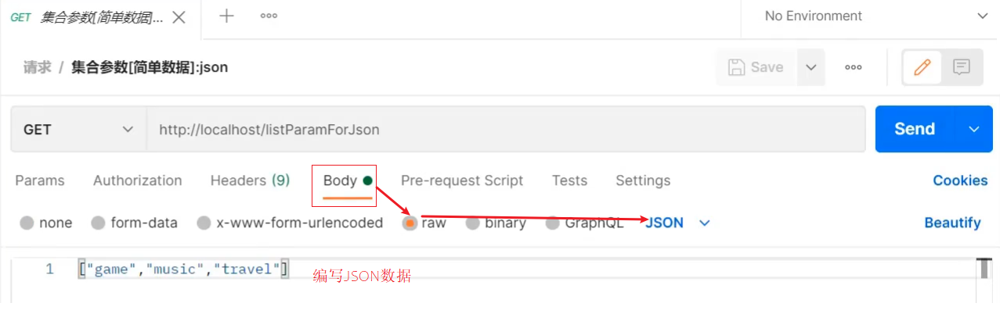
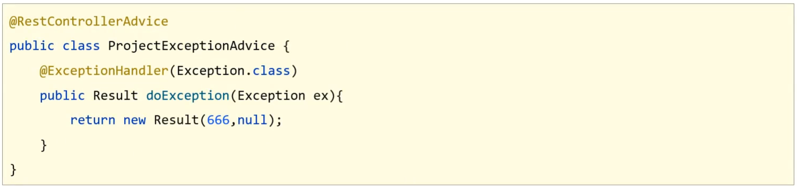

- [SpringMVC 笔记](#springmvc-笔记)
- [1. SpringMVC 概述](#1-springmvc-概述)
  - [1.1 Bean 加载控制](#11-bean-加载控制)
- [2. 请求与响应](#2-请求与响应)
  - [2.1 五种类型参数传递](#21-五种类型参数传递)
    - [2.1.1 普通参数](#211-普通参数)
    - [2.1.2 POJO数据类型](#212-pojo数据类型)
    - [2.1.3 嵌套 POJO 类型参数](#213-嵌套-pojo-类型参数)
    - [2.1.4 数组类型参数](#214-数组类型参数)
    - [2.1.5 集合类型参数](#215-集合类型参数)
  - [2.2 JSON数据传输参数](#22-json数据传输参数)
    - [2.2.1 JSON 普通数组](#221-json-普通数组)
    - [2.2.2 JSON对象数据](#222-json对象数据)
    - [2.2.3 JSON 对象数组](#223-json-对象数组)
  - [2.3 日期类型参数传递](#23-日期类型参数传递)
    - [2.3.1 编写方法接收日期数据](#231-编写方法接收日期数据)
    - [2.3.2 更换日期格式](#232-更换日期格式)
    - [2.3.3 携带时间的日期](#233-携带时间的日期)
  - [2.4 响应](#24-响应)
    - [2.4.1 响应页面\[了解\]](#241-响应页面了解)
    - [2.4.2 返回文本数据\[了解\]](#242-返回文本数据了解)
    - [2.4.3 响应JSON数据](#243-响应json数据)
- [3. Rest 风格](#3-rest-风格)
  - [3.1 REST简介](#31-rest简介)
    - [3.1.1 传递路径参数](#311-传递路径参数)
    - [3.1.2 RESTful 简化开发](#312-restful-简化开发)
- [4. SSM 整合](#4-ssm-整合)
- [5. 统一异常处理](#5-统一异常处理)
  - [5.1 异常处理器的使用](#51-异常处理器的使用)
  - [5.2 项目异常处理方案](#52-项目异常处理方案)
    - [5.2.1 异常分类](#521-异常分类)
    - [5.2.2 异常解决方案](#522-异常解决方案)
    - [5.2.3 解决方案具体实现](#523-解决方案具体实现)
- [6. 拦截器](#6-拦截器)
  - [6.1 拦截器概念](#61-拦截器概念)
  - [6.2 拦截器参数](#62-拦截器参数)
    - [6.2.1 前置处理方法](#621-前置处理方法)
    - [6.2.2 后置处理方法](#622-后置处理方法)
    - [6.2.3 完成处理方法](#623-完成处理方法)
    - [6.2.4 拦截器链配置](#624-拦截器链配置)

# SpringMVC 笔记

SpringMVC 是隶属于 Spring 框架的一部分，主要是用来进行 Web 开发，是对 Servlet 进行了封装。

对于 SpringMVC 主要学习如下内容:

* SpringMVC 简介
* ==请求与响应==
* ==REST风格==
* ==SSM整合(注解版)==
* 拦截器

SpringMVC 是处于 Web 层的框架，所以其主要的作用就是用来接收前端发过来的请求和数据然后经过处理并将处理的结果响应给前端，所以如何处理请求和响应是 SpringMVC 中非常重要的一块内容。

REST 是一种软件架构风格，可以降低开发的复杂性，提高系统的可伸缩性，后期的应用也是非常广泛。

SSM 整合是把 SpringMVC + Spring + Mybatis 整合在一起来完成业务开发。

# 1. SpringMVC 概述

随着互联网的发展，同步调用性能慢慢的跟不是需求，所以异步调用慢慢的走到了前台，是现在比较流行的一种处理方式。


* 因为是异步调用，所以后端不需要返回 view 视图，将其去除
* 前端如果通过异步调用的方式进行交互，后台就需要将返回的数据转换成 json 格式进行返回
* SpringMVC ==主要== 负责的就是
  * controller 如何接收请求和数据
  * 如何将请求和数据转发给业务层
  * 如何将响应数据转换成 json 发回到前端

* SpringMVC 是一种基于 Java 实现 MVC 模型的轻量级 Web 框架

* 优点

  * 使用简单、开发便捷 (相比于 Servlet )
  * 灵活性强

**知识点1：@Controller**

| 名称 | @Controller                   |
| ---- | ----------------------------- |
| 类型 | 类注解                        |
| 位置 | SpringMVC控制器类定义上方     |
| 作用 | 设定SpringMVC的核心控制器bean |

**知识点2：@RequestMapping**

| 名称     | @RequestMapping                 |
| -------- | ------------------------------- |
| 类型     | 类注解或方法注解                |
| 位置     | SpringMVC控制器类或方法定义上方 |
| 作用     | 设置当前控制器方法请求访问路径  |
| 相关属性 | value(默认)，请求访问路径       |

**知识点3：@ResponseBody**

| 名称 | @ResponseBody                                    |
| ---- | ------------------------------------------------ |
| 类型 | 类注解或方法注解                                 |
| 位置 | SpringMVC控制器类或方法定义上方                  |
| 作用 | 设置当前控制器方法响应内容为当前返回值，无需解析 |

- 多次工作
  - 定义处理请求的控制器类
  - 定义处理请求的控制器方法，并配置映射路径（@RequestMapping）与返回 json 数据（@ResponseBody）

## 1.1 Bean 加载控制

* 加载 Spring 控制的 bean 的时候排除掉 SpringMVC 控制的 bean

具体该如何排除：

* 方式一：Spring 加载的 bean 设定扫描范围为精准范围，例如 service 包、 dao 包等
* 方式二：Spring 加载的 bean 设定扫描范围为 com.itheima， 排除掉 controller 包中的 bean
* 方式三：不区分 Spring 与 SpringMVC 的环境，加载到同一个环境中[了解即可]

**知识点1：@ComponentScan**

| 名称     | @ComponentScan                                               |
| -------- | ------------------------------------------------------------ |
| 类型     | 类注解                                                       |
| 位置     | 类定义上方                                                   |
| 作用     | 设置 Spring 配置类扫描路径，用于加载使用注解格式定义的 Bean  |
| 相关属性 | excludeFilters：排除扫描路径中加载的 bean，需要指定类别 (type) 和具体项 (classes) <br/>includeFilters：加载指定的bean，需要指定类别 (type) 和具体项 (classes) |

# 2. 请求与响应

主要包含四部分内容:

* 请求映射路径
* 请求参数
* 日期类型参数传递
* 响应json数据

## 2.1 五种类型参数传递

常见的参数传递种类有:

* 普通参数
* POJO类型参数
* 嵌套POJO类型参数
* 数组类型参数
* 集合类型参数

### 2.1.1 普通参数

* 普通参数：url 地址传参，地址参数名与形参变量名相同，定义形参即可接收参数。


如果形参与地址参数名不一致该如何解决?

解决方案：使用 @RequestParam 注解

```java
@RequestMapping("/commonParamDifferentName")
    @ResponseBody
    public String commonParamDifferentName(@RequestPaam("name") String userName , int age){
        return "{'module':'common param different name'}";
    }
```

**注意：写上 @RequestParam 注解框架就不需要自己去解析注入，能提升框架处理性能**

### 2.1.2 POJO数据类型

简单数据类型一般处理的是参数个数比较少的请求，如果参数比较多，那么后台接收参数的时候就比较复杂，这个时候我们可以考虑使用 POJO 数据类型。

* POJO 参数：请求参数名与形参对象属性名相同，定义 POJO 类型形参即可接收参数

此时需要使用前面准备好的POJO类，先来看下User

```java
public class User {
    private String name;
    private int age;
    //setter...getter...略
}
```

后台接收参数:

```java
//POJO参数：请求参数与形参对象中的属性对应即可完成参数传递
@RequestMapping("/pojoParam")
@ResponseBody
public String pojoParam(User user){
    System.out.println("pojo参数传递 user ==> "+user);
    return "{'module':'pojo param'}";
}
```

**注意:**

* POJO参数接收，前端GET和POST发送请求数据的方式不变。
* ==请求参数key的名称要和POJO中属性的名称一致，否则无法封装。==

### 2.1.3 嵌套 POJO 类型参数

如果 POJO 对象中嵌套了其他的 POJO 类

```java
public class Address {
    private String province;
    private String city;
    //setter...getter...略
}
public class User {
    private String name;
    private int age;
    private Address address;
    //setter...getter...略
}
```

* 嵌套 POJO 参数：请求参数名与形参对象属性名相同，按照对象层次结构关系即可接收嵌套 POJO 属性参数

发送请求和参数:


后台接收参数:

```java
//POJO参数：请求参数与形参对象中的属性对应即可完成参数传递
@RequestMapping("/pojoParam")
@ResponseBody
public String pojoParam(User user){
    return "{'module':'pojo param'}";
}
```

**注意:**

==请求参数 key 的名称要和 POJO 中属性的名称一致，否则无法封装==

### 2.1.4 数组类型参数

* 数组参数：请求参数名与形参对象属性名相同且请求参数为多个，定义数组类型即可接收参数

发送请求和参数:


后台接收参数:

```java
  //数组参数：同名请求参数可以直接映射到对应名称的形参数组对象中
    @RequestMapping("/arrayParam")
    @ResponseBody
    public String arrayParam(String[] likes){
        System.out.println("数组参数传递 likes ==> "+ Arrays.toString(likes));
        return "{'module':'array param'}";
    }
```

### 2.1.5 集合类型参数

数组能接收多个值，那么集合是否也可以实现这个功能呢?

发送请求和参数:


错误的原因是：SpringMVC 将 List 看做是一个 POJO 对象来处理，将其创建一个对象并准备把前端的数据封装到对象中，但是 List 是一个接口无法创建对象，所以报错。

解决方案：使用 `@RequestParam` 注解

```java
//集合参数：同名请求参数可以使用@RequestParam注解映射到对应名称的集合对象中作为数据
@RequestMapping("/listParam")
@ResponseBody
public String listParam(@RequestParam List<String> likes){
    System.out.println("集合参数传递 likes ==> "+ likes);
    return "{'module':'list param'}";
}
```

* 集合保存普通参数：请求参数名与形参集合对象名相同且请求参数为多个，@RequestParam 绑定参数关系
* 对于简单数据类型使用数组会比集合更简单些。

**知识点1：@RequestParam**

| 名称     | @RequestParam                                          |
| -------- | ------------------------------------------------------ |
| 类型     | 形参注解                                               |
| 位置     | SpringMVC控制器方法形参定义前面                        |
| 作用     | 绑定请求参数与处理器方法形参间的关系                   |
| 相关参数 | required：是否为必传参数 <br/>defaultValue：参数默认值 |

## 2.2 JSON数据传输参数

异步调用，前后台以异步方式进行交换，传输的数据使用的是==JSON==

对于JSON数据类型，我们常见的有三种:

- json 普通数组（[ "value1", "value2" , "value3" , ...]）
- json 对象（{key1 : value1 , key2 : value2 , ...}）
- json 对象数组（[{key1 : value1 , ...} , { key2 : value2 , ...}]）

对于上述数据，前端如何发送，后端如何接收?

### 2.2.1 JSON 普通数组

**PostMan 发送 JSON 数据**



使用 @RequestBody 注解将外部传递的 json 数组数据映射到形参的集合对象中作为数据

```java
@RequestMapping("/listParamForJson")
@ResponseBody
public String listParamForJson(@RequestBody List<String> likes){
    System.out.println("list common(json)参数传递 list ==> "+likes);
    return "{'module':'list common for json param'}";
}
```

### 2.2.2 JSON对象数据

请求和数据的发送:

```json
{
	"name":"itcast",
	"age":15
}
```


后端接收数据：

```java
@RequestMapping("/pojoParamForJson")
@ResponseBody
public String pojoParamForJson(@RequestBody User user){
    System.out.println("pojo(json)参数传递 user ==> "+user);
    return "{'module':'pojo for json param'}";
}
```

如果想要 address 也有数据，我们需求修改前端传递的数据内容:

```json
{
	"name":"itcast",
	"age":15,
    "address":{
        "province":"beijing",
        "city":"beijing"
    }
}
```

再次发送请求，就能看到 address 中的数据。

### 2.2.3 JSON 对象数组

集合中保存多个 POJO 该如何实现?

请求和数据的发送:

```json
[
    {"name":"itcast","age":15},
    {"name":"itheima","age":12}
]
```

 

后端接收数据:

```java
@RequestMapping("/listPojoParamForJson")
@ResponseBody
public String listPojoParamForJson(@RequestBody List<User> list){
    System.out.println("list pojo(json)参数传递 list ==> "+list);
    return "{'module':'list pojo for json param'}";
}
```

Controller 方法的参数前添加 @RequestBody 注解

**知识点 1：@RequestBody**

| 名称 | @RequestBody                                                 |
| ---- | ------------------------------------------------------------ |
| 类型 | ==形参注解==                                                 |
| 位置 | SpringMVC 控制器方法形参定义前面                             |
| 作用 | 将请求中请求体所包含的数据传递给请求参数，此注解一个处理器方法只能使用一次 |

**@RequestBody 与 @RequestParam 区别**

* 区别
  * @RequestParam 用于接收 url 地址传参，表单传参 【application/x-www-form-urlencoded】
  * @RequestBody 用于接收 json 数据【application/json】

* 应用
  * 后期开发中，发送 json 格式数据为主，@RequestBody 应用较广
  * 如果发送非 json 格式数据，选用 @RequestParam 接收请求参数

## 2.3 日期类型参数传递

### 2.3.1 编写方法接收日期数据

在 UserController 类中添加方法，把参数设置为日期类型

```java
@RequestMapping("/dataParam")
@ResponseBody
public String dataParam(Date date)
    System.out.println("参数传递 date ==> "+date);
    return "{'module':'data param'}";
}
```

### 2.3.2 更换日期格式

为了能更好的看到程序运行的结果，我们在方法中多添加一个日期参数

```java
@RequestMapping("/dataParam")
@ResponseBody
public String dataParam(Date date,
                        @DateTimeFormat(pattern="yyyy-MM-dd") Date date1)
    System.out.println("参数传递 date ==> "+date);
	System.out.println("参数传递 date1(yyyy-MM-dd) ==> "+date1);
    return "{'module':'data param'}";
}
```

使用 PostMan 发送请求，携带两个不同的日期格式，

`http://localhost/dataParam?date=2088/08/08&date1=2088-08-08`

### 2.3.3 携带时间的日期

先修改UserController类，添加第三个参数

```java
@RequestMapping("/dataParam")
@ResponseBody
public String dataParam(Date date,
                        @DateTimeFormat(pattern="yyyy-MM-dd") Date date1,
                        @DateTimeFormat(pattern="yyyy/MM/dd HH:mm:ss") Date date2)
    System.out.println("参数传递 date ==> "+date);
	System.out.println("参数传递 date1(yyyy-MM-dd) ==> "+date1);
	System.out.println("参数传递 date2(yyyy/MM/dd HH:mm:ss) ==> "+date2);
    return "{'module':'data param'}";
}
```

使用PostMan发送请求，携带两个不同的日期格式，

`http://localhost/dataParam?date=2088/08/08&date1=2088-08-08&date2=2088/08/08 8:08:08`


**知识点1：@DateTimeFormat**

| 名称     | @DateTimeFormat                 |
| -------- | ------------------------------- |
| 类型     | ==形参注解==                    |
| 位置     | SpringMVC 控制器方法形参前面    |
| 作用     | 设定日期时间型数据格式          |
| 相关属性 | pattern：指定日期时间格式字符串 |

## 2.4 响应

对于响应，主要就包含两部分内容：

* 响应页面
* 响应数据
  * 文本数据
  * json 数据

因为异步调用是目前常用的主流方式，所以我们需要更关注的就是如何返回 JSON 数据

### 2.4.1 响应页面[了解]

```java
@Controller
public class UserController {
    
    @RequestMapping("/toJumpPage")
    //注意
    //1.此处不能添加@ResponseBody,如果加了该注入，会直接将page.jsp当字符串返回前端
    //2.方法需要返回String
    public String toJumpPage(){
        System.out.println("跳转页面");
        return "page.jsp";
    }
    
}
```

### 2.4.2 返回文本数据[了解]

```java
@Controller
public class UserController {
    
   	@RequestMapping("/toText")
	//注意此处该注解就不能省略，如果省略了,会把response text当前页面名称去查找，如果没有回报404错误
    @ResponseBody
    public String toText(){
        System.out.println("返回纯文本数据");
        return "response text";
    }
    
}
```

### 2.4.3 响应JSON数据

**响应 POJO 对象**

```java
@Controller
public class UserController {
    @RequestMapping("/toJsonPOJO")
    @ResponseBody
    public User toJsonPOJO(){
        System.out.println("返回json对象数据");
        User user = new User();
        user.setName("itcast");
        user.setAge(15);
        return user;
    }
}
```

返回值为实体类对象，设置返回值为实体类类型，即可实现返回对应对象的 json 数据，需要依赖 ==@ResponseBody== 注解和 ==@EnableWebMvc== 注解

**响应 POJO 集合对象**

```java
@Controller
public class UserController {
    
    @RequestMapping("/toJsonList")
    @ResponseBody
    public List<User> toJsonList(){
        System.out.println("返回json集合数据");
        User user1 = new User();
        user1.setName("传智播客");
        user1.setAge(15);

        User user2 = new User();
        user2.setName("黑马程序员");
        user2.setAge(12);

        List<User> userList = new ArrayList<User>();
        userList.add(user1);
        userList.add(user2);
        return userList;
    }
}
```


**知识点1：@ResponseBody**

| 名称     | @ResponseBody                                                |
| -------- | ------------------------------------------------------------ |
| 类型     | ==方法\类注解==                                              |
| 位置     | SpringMVC 控制器方法定义上方和控制类上                       |
| 作用     | 设置当前控制器返回值作为响应体，<br/>写在类上，该类的所有方法都有该注解功能 |
| 相关属性 | pattern：指定日期时间格式字符串                              |

**说明:**

* 该注解可以写在类上或者方法上
* 写在类上就是该类下的所有方法都有 @ReponseBody 功能
* 当方法上有 @ReponseBody 注解后
  * 方法的返回值为字符串，会将其作为文本内容直接响应给前端
  * 方法的返回值为对象，会将对象转换成 JSON 响应给前端

此处又使用到了类型转换，内部还是通过 Converter 接口的实现类完成的，所以 Converter 除了前面所说的功能外，它还可以实现:

* 对象转 Json 数据 (POJO -> json)
* 集合转 Json 数据 (Collection -> json)

# 3. Rest 风格

## 3.1 REST简介

==REST==（Representational State Transfer），表现形式状态转换,它是一种软件架构==风格==

当我们想表示一个网络资源的时候，可以使用两种方式:

* 传统风格资源描述形式
  * `http://localhost/user/getById?id=1` 查询id为1的用户信息
  * `http://localhost/user/saveUser` 保存用户信息
* REST风格描述形式
  * `http://localhost/user/1` 
  * `http://localhost/user`

REST 的优点有:

- 隐藏资源的访问行为，无法通过地址得知对资源是何种操作
- 书写简化

按照REST风格访问资源时使用==行为动作==区分对资源进行了何种操作

* `http://localhost/users`	查询全部用户信息 GET（查询）
* `http://localhost/users/1`  查询指定用户信息 GET（查询）
* `http://localhost/users`    添加用户信息    POST（新增/保存）
* `http://localhost/users`    修改用户信息    PUT（修改/更新）
* `http://localhost/users/1`  删除用户信息    DELETE（删除）

请求的方式比较多，但是比较常用的就4种，分别是`GET`， `POST` ， `PUT` ， `DELETE` 。

按照不同的请求方式代表不同的操作类型。

* 发送 GET 请求是用来做查询
* 发送 POST 请求是用来做新增
* 发送 PUT 请求是用来做修改
* 发送 DELETE 请求是用来做删除

但是==注意==:

*  上述行为是约定方式，约定不是规范，可以打破，所以称 REST 风格，而不是 REST 规范
  *  REST 提供了对应的架构方式，按照这种架构设计项目可以降低开发的复杂性，提高系统的可伸缩性
  *  REST 中规定 GET / POST / PUT / DELETE 针对的是查询 / 新增 / 修改 / 删除，但是我们如果非要用 GET 请求做删除，这点在程序上运行是可以实现的
  * 但是如果绝大多数人都遵循这种风格，你写的代码让别人读起来就有点莫名其妙了。
* 描述模块的名称通常使用复数，也就是加 s 的格式描述，表示此类资源，而非单个资源，例如：users、books、accounts......

根据REST风格对资源进行访问称为==RESTful==。

### 3.1.1 传递路径参数

前端发送请求的时候使用：`http://localhost/users/1` ，路径中的 `1` 就是我们想要传递的参数。

后端获取参数，需要做如下修改:

* 修改 @RequestMapping 的 value 属性，将其中修改为 `/users/{id}` ，目的是和路径匹配
* 在方法的形参前添加 @PathVariable 注解

```java
@Controller
public class UserController {
    //设置当前请求方法为DELETE，表示REST风格中的删除操作
	@RequestMapping(value = "/users/{id}",method = RequestMethod.DELETE)
    @ResponseBody
    public String delete(@PathVariable Integer id) {
        System.out.println("user delete..." + id);
        return "{'module':'user delete'}";
    }
}
```

**思考如下两个问题:**

（1）如果方法形参的名称和路径`{}`中的值不一致，该怎么办?


（2）如果有多个参数需要传递该如何编写?

前端发送请求的时候使用： `http://localhost/users/1/tom` ，路径中的 `1` 和 `tom` 就是我们想要传递的两个参数。

后端获取参数，需要做如下修改:

```java
@Controller
public class UserController {
    //设置当前请求方法为DELETE，表示REST风格中的删除操作
	@RequestMapping(value = "/users/{id}/{name}",method = RequestMethod.DELETE)
    @ResponseBody
    public String delete(@PathVariable Integer id,@PathVariable String name) {
        System.out.println("user delete..." + id+","+name);
        return "{'module':'user delete'}";
    }
}
```

学习内容如下:

(1)设定Http请求动作(动词)

@RequestMapping(value="",==method== = RequestMethod.==POST|GET|PUT|DELETE==)

(2)设定请求参数(路径变量)

@RequestMapping(value="/users/=={id}==",method = RequestMethod.DELETE)

@ReponseBody

public String delete(==@PathVariable== Integer ==id==){

}

**知识点1：@PathVariable**

| 名称 | @PathVariable                                                |
| ---- | ------------------------------------------------------------ |
| 类型 | ==形参注解==                                                 |
| 位置 | SpringMVC 控制器方法形参定义前面                             |
| 作用 | 绑定路径参数与处理器方法形参间的关系，要求路径参数名与形参名一一对应 |

关于接收参数，我们学过三个注解 `@RequestBody`、 `@RequestParam` 、 `@PathVariable` ，这三个注解之间的区别和应用分别是什么?

* 区别
  * @RequestParam 用于接收 url 地址传参或表单传参
  * @RequestBody 用于接收 json 数据
  * @PathVariable 用于接收路径参数，使用 { 参数名称 } 描述路径参数
* 应用
  * 后期开发中，发送请求参数超过 1 个时，以 json 格式为主，@RequestBody 应用较广
  * 如果发送非 json 格式数据，选用 @RequestParam 接收请求参数
  * 采用 RESTful 进行开发，当参数数量较少时，例如 1 个，可以采用 @PathVariable 接收请求路径变量，通常用于传递 id 值

### 3.1.2 RESTful 简化开发

问题1：每个方法的 @RequestMapping 注解中都定义了访问路径 /books ，重复性太高。

```
将 @RequestMapping 提到类上面，用来定义所有方法共同的访问路径。
```

问题2：每个方法的 @RequestMapping 注解中都要使用 method 属性定义请求方式，重复性太高。

```
使用 @GetMapping  @PostMapping  @PutMapping  @DeleteMapping 代替
```

问题3：每个方法响应 json 都需要加上 @ResponseBody 注解，重复性太高。

```
1. 将 ResponseBody 提到类上面，让所有的方法都有 @ResponseBody 的功能
2.使用 @RestController 注解替换 @Controller 与 @ResponseBody 注解，简化书写
```

**知识点1：@RestController**

| 名称 | @RestController                                              |
| ---- | ------------------------------------------------------------ |
| 类型 | ==类注解==                                                   |
| 位置 | 基于 SpringMVC 的 RESTful 开发控制器类定义上方               |
| 作用 | 设置当前控制器类为 RESTful 风格，<br/>等同于 @Controller 与 @ResponseBody 两个注解组合功能 |

**知识点2：@GetMapping @PostMapping @PutMapping @DeleteMapping**

| 名称     | @GetMapping @PostMapping @PutMapping @DeleteMapping          |
| -------- | ------------------------------------------------------------ |
| 类型     | ==方法注解==                                                 |
| 位置     | 基于 SpringMVC 的 RESTful 开发控制器方法定义上方             |
| 作用     | 设置当前控制器方法请求访问路径与请求动作，每种对应一个请求动作，<br/>例如 @GetMapping 对应 GET 请求 |
| 相关属性 | value（默认）：请求访问路径                                  |

# 4. SSM 整合

**说明:**

* bookDao 在 Service 中注入的会提示一个红线提示，为什么呢?

  * BookDao 是一个接口，没有实现类，接口是不能创建对象的，所以最终注入的应该是代理对象
  * 代理对象是由 Spring 的 IOC 容器来创建管理的
  * IOC 容器又是在 Web 服务器启动的时候才会创建
  * IDEA 在检测依赖关系的时候，没有找到适合的类注入，所以会提示错误提示
  * 但是程序运行的时候，代理对象就会被创建，框架会使用 DI 进行注入，所以程序运行无影响。

# 5. 统一异常处理

在解决问题之前，我们先来看下异常的种类及出现异常的原因:

- 框架内部抛出的异常：因使用不合规导致
- 数据层抛出的异常：因外部服务器故障导致（例如：服务器访问超时）
- 业务层抛出的异常：因业务逻辑书写错误导致（例如：遍历业务书写操作，导致索引异常等）
- 表现层抛出的异常：因数据收集、校验等规则导致（例如：不匹配的数据类型间导致异常）
- 工具类抛出的异常：因工具类书写不严谨不够健壮导致（例如：必要释放的连接长期未释放等）

看完上面这些出现异常的位置，你会发现，在我们开发的任何一个位置都有可能出现异常，而且这些异常是不能避免的。所以我们就得将异常进行处理。

**思考**

1. 各个层级均出现异常，异常处理代码书写在哪一层?

   ==所有的异常均抛出到表现层进行处理==

2. 异常的种类很多，表现层如何将所有的异常都处理到呢?

   ==异常分类==

3. 表现层处理异常，每个方法中单独书写，代码书写量巨大且意义不强，如何解决?

   ==AOP==

对于上面这些问题及解决方案，SpringMVC 已经为我们提供了一套解决方案:

* 异常处理器:

  * 集中的、统一的处理项目中出现的异常。

    

## 5.1 异常处理器的使用

**步骤1:创建异常处理器类**

```java
//@RestControllerAdvice用于标识当前类为REST风格对应的异常处理器
@RestControllerAdvice
public class ProjectExceptionAdvice {
    //除了自定义的异常处理器，保留对Exception类型的异常处理，用于处理非预期的异常
    @ExceptionHandler(Exception.class)
    public void doException(Exception ex){
      	System.out.println("嘿嘿,异常你哪里跑！")
    }
}

```

==确保 SpringMvcConfig 能够扫描到异常处理器类==

**步骤2:让程序抛出异常**

修改 `BookController` 的 getById 方法，添加 `int i = 1/0`.

```java
@GetMapping("/{id}")
public Result getById(@PathVariable Integer id) {
  	int i = 1/0;
    Book book = bookService.getById(id);
    Integer code = book != null ? Code.GET_OK : Code.GET_ERR;
    String msg = book != null ? "" : "数据查询失败，请重试！";
    return new Result(code,book,msg);
}
```

**知识点1：@RestControllerAdvice**

| 名称 | @RestControllerAdvice               |
| ---- | ----------------------------------- |
| 类型 | ==类注解==                          |
| 位置 | Rest 风格开发的控制器增强类定义上方 |
| 作用 | 为 Rest 风格开发的控制器类做增强    |

**说明：**此注解自带 @ResponseBody 注解与 @Component 注解，具备对应的功能


**知识点2：@ExceptionHandler**

| 名称 | @ExceptionHandler                                            |
| ---- | ------------------------------------------------------------ |
| 类型 | ==方法注解==                                                 |
| 位置 | 专用于异常处理的控制器方法上方                               |
| 作用 | 设置指定异常的处理方案，功能等同于控制器方法，<br/>出现异常后终止原始控制器执行,并转入当前方法执行 |

**说明：**此类方法可以根据处理的异常不同，制作多个方法分别处理对应的异常

## 5.2 项目异常处理方案

### 5.2.1 异常分类

异常处理器我们已经能够使用了，那么在咱们的项目中该如何来处理异常呢?

因为异常的种类有很多，如果每一个异常都对应一个 @ExceptionHandler，那得写多少个方法来处理各自的异常，所以我们在处理异常之前，需要对异常进行一个分类:

- 业务异常（BusinessException）

  - 规范的用户行为产生的异常

    - 用户在页面输入内容的时候未按照指定格式进行数据填写，如在年龄框输入的是字符串

  - 不规范的用户行为操作产生的异常

    - 如用户故意传递错误数据

- 系统异常（SystemException）

  - 项目运行过程中可预计但无法避免的异常
    - 比如数据库或服务器宕机

- 其他异常（Exception）

  - 编程人员未预期到的异常，如:用到的文件不存在

    

将异常分类以后，针对不同类型的异常，要提供具体的解决方案:

### 5.2.2 异常解决方案

- 业务异常（BusinessException）
  - 发送对应消息传递给用户，提醒规范操作
    - 大家常见的就是提示用户名已存在或密码格式不正确等
- 系统异常（SystemException）
  - 发送固定消息传递给用户，安抚用户
    - 系统繁忙，请稍后再试
    - 系统正在维护升级，请稍后再试
    - 系统出问题，请联系系统管理员等
  - 发送特定消息给运维人员，提醒维护
    - 可以发送短信、邮箱或者是公司内部通信软件
  - 记录日志
    - 发消息和记录日志对用户来说是不可见的，属于后台程序
- 其他异常（Exception）
  - 发送固定消息传递给用户，安抚用户
  - 发送特定消息给编程人员，提醒维护（纳入预期范围内）
    - 一般是程序没有考虑全，比如未做非空校验等
  - 记录日志

### 5.2.3 解决方案具体实现

> 思路:
>
> 1. 先通过自定义异常，完成 BusinessException 和 SystemException 的定义
>
> 2. 将其他异常包装成自定义异常类型
>
> 3. 在异常处理器类中对不同的异常进行处理

**步骤1:自定义异常类**

```java
//自定义异常处理器，用于封装异常信息，对异常进行分类
public class SystemException extends RuntimeException{
    private Integer code;

    public Integer getCode() {
        return code;
    }

    public void setCode(Integer code) {
        this.code = code;
    }

    public SystemException(Integer code, String message) {
        super(message);
        this.code = code;
    }

    public SystemException(Integer code, String message, Throwable cause) {
        super(message, cause);
        this.code = code;
    }

}

//自定义异常处理器，用于封装异常信息，对异常进行分类
public class BusinessException extends RuntimeException{
    private Integer code;

    public Integer getCode() {
        return code;
    }

    public void setCode(Integer code) {
        this.code = code;
    }

    public BusinessException(Integer code, String message) {
        super(message);
        this.code = code;
    }

    public BusinessException(Integer code, String message, Throwable cause) {
        super(message, cause);
        this.code = code;
    }

}


```

**说明:**

* 让自定义异常类继承 `RuntimeException` 的好处是，后期在抛出这两个异常的时候，就不用在 try...catch... 或 throws 了
* 自定义异常类中添加 `code` 属性的原因是为了更好的区分异常是来自哪个业务的

**步骤2：将其他异常包成自定义异常**

假如在 BookServiceImpl 的 getById 方法抛异常了，该如何来包装呢?

```java
public Book getById(Integer id) {
    //模拟业务异常，包装成自定义异常
    if(id == 1){
        throw new BusinessException(Code.BUSINESS_ERR,"请不要使用你的技术挑战我的耐性!");
    }
    //模拟系统异常，将可能出现的异常进行包装，转换成自定义异常
    try{
        int i = 1/0;
    }catch (Exception e){
        throw new SystemException(Code.SYSTEM_TIMEOUT_ERR,"服务器访问超时，请重试!",e);
    }
    return bookDao.getById(id);
}
```

具体的包装方式有：

* 方式一: `try{}catch(){}` 在 catch 中重新 throw 我们自定义异常即可。
* 方式二: 直接 throw 自定义异常即可

**步骤3: 处理器类中处理自定义异常**

```java
//@RestControllerAdvice用于标识当前类为REST风格对应的异常处理器
@RestControllerAdvice
public class ProjectExceptionAdvice {
    //@ExceptionHandler用于设置当前处理器类对应的异常类型
    @ExceptionHandler(SystemException.class)
    public Result doSystemException(SystemException ex){
        //记录日志
        //发送消息给运维
        //发送邮件给开发人员,ex对象发送给开发人员
        return new Result(ex.getCode(),null,ex.getMessage());
    }

    @ExceptionHandler(BusinessException.class)
    public Result doBusinessException(BusinessException ex){
        return new Result(ex.getCode(),null,ex.getMessage());
    }

    //除了自定义的异常处理器，保留对Exception类型的异常处理，用于处理非预期的异常
    @ExceptionHandler(Exception.class)
    public Result doOtherException(Exception ex){
        //记录日志
        //发送消息给运维
        //发送邮件给开发人员,ex对象发送给开发人员
        return new Result(Code.SYSTEM_UNKNOW_ERR,null,"系统繁忙，请稍后再试！");
    }
}
```

**小结**

以后项目中的异常处理方式为:


# 6. 拦截器

对于拦截器，需要学习如下内容:

* 拦截器概念
* 入门案例
* 拦截器参数
* 拦截器工作流程分析

## 6.1 拦截器概念

讲解拦截器的概念之前，我们先看一张图:


1. 浏览器发送一个请求会先到 Tomcat 的 web 服务器

2. Tomcat 服务器接收到请求以后，会去判断请求的是静态资源还是动态资源

3. 如果是静态资源，会直接到 Tomcat 的项目部署目录下去直接访问

4. 如果是动态资源，就需要交给项目的后台代码进行处理

5. 在找到具体的方法之前，我们可以去配置过滤器(可以配置多个)，按照顺序进行执行

6. 然后进入到到中央处理器( SpringMVC 中的内容)， SpringMVC 会根据配置的规则进行拦截

7. 如果满足规则，则进行处理，找到其对应的 controller 类中的方法进行执行,完成后返回结果

8. 如果不满足规则，则不进行处理

9. 这个时候，如果我们需要在每个 Controller 方法执行的前后添加业务，具体该如何来实现?

这个就是拦截器要做的事。

* 拦截器（Interceptor）是一种动态拦截方法调用的机制，在 SpringMVC 中动态拦截控制器方法的执行
* 作用:
  * 在指定的方法调用前后执行预先设定的代码
  * 阻止原始方法的执行
  * 总结：拦截器就是用来做增强

看完以后，大家会发现

* 拦截器和过滤器在作用和执行顺序上也很相似

所以这个时候，就有一个问题需要思考：拦截器和过滤器之间的区别是什么?

- 归属不同：Filter 属于 Servlet 技术，Interceptor 属于 SpringMVC 技术
- 拦截内容不同：Filter 对所有访问进行增强，Interceptor 仅针对 SpringMVC 的访问进行增强


最后我们来看下拦截器的执行流程:


当有拦截器后，请求会先进入 preHandle 方法，

​	如果方法返回 true，则放行继续执行后面的 handle [controller 的方法] 和后面的方法

​	如果返回 false，则直接跳过后面方法的执行。

## 6.2 拦截器参数

### 6.2.1 前置处理方法

原始方法之前运行 preHandle

```java
public boolean preHandle(HttpServletRequest request,
                         HttpServletResponse response,
                         Object handler) throws Exception {
    System.out.println("preHandle");
    return true;
}
```

* request: 请求对象
* response: 响应对象
* handler: 被调用的处理器对象，本质上是一个方法对象，对反射中的 Method 对象进行了再包装

使用 request 对象可以获取请求数据中的内容，如获取请求头的 `Content-Type`

```java
public boolean preHandle(HttpServletRequest request, HttpServletResponse response, Object handler) throws Exception {
    String contentType = request.getHeader("Content-Type");
    System.out.println("preHandle..."+contentType);
    return true;
}
```

使用 handler 参数，可以获取方法的相关信息

```java
public boolean preHandle(HttpServletRequest request, HttpServletResponse response, Object handler) throws Exception {
    HandlerMethod hm = (HandlerMethod)handler;
    String methodName = hm.getMethod().getName();//可以获取方法的名称
    System.out.println("preHandle..."+methodName);
    return true;
}
```

### 6.2.2 后置处理方法

原始方法运行后运行，如果原始方法被拦截，则不执行  

```java
public void postHandle(HttpServletRequest request,
                       HttpServletResponse response,
                       Object handler,
                       ModelAndView modelAndView) throws Exception {
    System.out.println("postHandle");
}
```

前三个参数和上面的是一致的。

modelAndView : 如果处理器执行完成具有返回结果，可以读取到对应数据与页面信息，并进行调整

因为咱们现在都是返回 json 数据，所以该参数的使用率不高。

### 6.2.3 完成处理方法

拦截器最后执行的方法，无论原始方法是否执行

```java
public void afterCompletion(HttpServletRequest request,
                            HttpServletResponse response,
                            Object handler,
                            Exception ex) throws Exception {
    System.out.println("afterCompletion");
}
```

前三个参数与上面的是一致的。

ex：如果处理器执行过程中出现异常对象，可以针对异常情况进行单独处理  

因为我们现在已经有全局异常处理器类，所以该参数的使用率也不高。

这三个方法中，最常用的是==preHandle==，在这个方法中可以通过返回值来决定是否要进行放行，我们可以把业务逻辑放在该方法中，如果满足业务则返回 true 放行，不满足则返回 false拦截。

### 6.2.4 拦截器链配置

拦截器执行的顺序是和配置顺序有关。就和前面所提到的运维人员进入机房的案例，先进后出。

* 当配置多个拦截器时，形成拦截器链
* 拦截器链的运行顺序参照拦截器添加顺序为准
* 当拦截器中出现对原始处理器的拦截，后面的拦截器均终止运行
* 当拦截器运行中断，仅运行配置在前面的拦截器的 afterCompletion 操作


preHandle：与配置顺序相同，必定运行

postHandle：与配置顺序相反，可能不运行

afterCompletion：与配置顺序相反，可能不运行。

这个顺序不太好记，最终只需要把握住一个原则即可：==以最终的运行结果为准==


