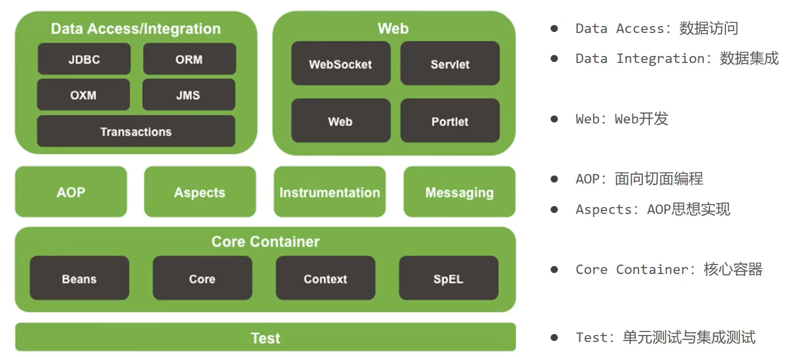
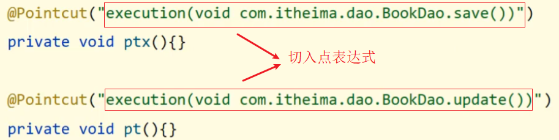
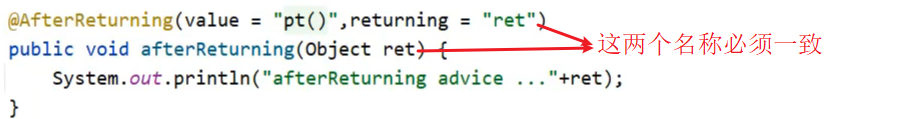
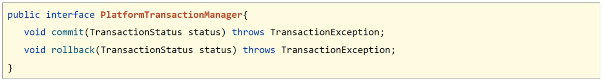
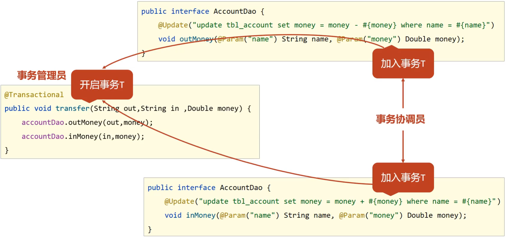

- [Spring 笔记](#spring-笔记)
- [1. Spring系统架构](#1-spring系统架构)
  - [1.1 系统架构](#11-系统架构)
  - [1.2 Spring核心概念](#12-spring核心概念)
    - [1.2.1 IOC（Inversion of Control）](#121-iocinversion-of-control)
    - [1.2.2 DI（Dependency Injection）](#122-didependency-injection)
    - [1.2.3 注解开发](#123-注解开发)
      - [Bean的作用范围](#bean的作用范围)
      - [Bean的生命周期](#bean的生命周期)
  - [1.3 注解开发依赖注入](#13-注解开发依赖注入)
    - [1.3.1 注解实现按照类型注入](#131-注解实现按照类型注入)
    - [1.3.2 注解实现按照名称注入](#132-注解实现按照名称注入)
    - [1.3.3 简单数据类型注入](#133-简单数据类型注入)
    - [1.3.4 注解读取 properties 配置文件](#134-注解读取-properties-配置文件)
      - [知识点1：@Autowired](#知识点1autowired)
      - [知识点2：@Qualifier](#知识点2qualifier)
      - [知识点3：@Value](#知识点3value)
      - [知识点4：@PropertySource](#知识点4propertysource)
  - [1.4 IOC/DI 注解开发管理第三方 bean](#14-iocdi-注解开发管理第三方-bean)
    - [1.4.1 注解开发管理第三方 bean](#141-注解开发管理第三方-bean)
    - [1.4.2 注解开发实现为第三方 bean 注入资源](#142-注解开发实现为第三方-bean-注入资源)
      - [简单数据类型](#简单数据类型)
      - [引用数据类型](#引用数据类型)
    - [1.4.3 注解开发总结](#143-注解开发总结)
- [2. Spring 整合](#2-spring-整合)
  - [2.1  Spring 整合 Mybatis 思路分析](#21--spring-整合-mybatis-思路分析)
  - [2.2 Spring 整合 Junit](#22-spring-整合-junit)
- [3. AOP 功能与介绍](#3-aop-功能与介绍)
  - [3.1 AOP 简介](#31-aop-简介)
    - [3.1.1 概述](#311-概述)
    - [3.1.2 AOP 作用](#312-aop-作用)
    - [3.1.2 AOP核心概念](#312-aop核心概念)
  - [3.2 AOP 入门案例](#32-aop-入门案例)
  - [3.3 AOP 工作流程](#33-aop-工作流程)
    - [3.3.1 初始化 bean](#331-初始化-bean)
    - [3.3.2 获取 bean 执行方法](#332-获取-bean-执行方法)
    - [3.3.4 AOP 核心概念](#334-aop-核心概念)
  - [3.3 AOP 配置管理](#33-aop-配置管理)
    - [3.3.1 语法格式](#331-语法格式)
    - [3.3.2 通配符](#332-通配符)
    - [3.3.3 书写技巧](#333-书写技巧)
    - [3.3.4 AOP 通知类型](#334-aop-通知类型)
    - [3.3.4 AOP 通知获取数据](#334-aop-通知获取数据)
      - [1. 获取参数](#1-获取参数)
      - [2. 获取返回值](#2-获取返回值)
      - [3. 获取异常](#3-获取异常)
  - [3.4 AOP 总结](#34-aop-总结)
    - [3.4.1 AOP的核心概念](#341-aop的核心概念)
    - [3.4.2  切入点表达式](#342--切入点表达式)
    - [3.4.3 五种通知类型](#343-五种通知类型)
    - [3.4.4 通知中获取参数](#344-通知中获取参数)
- [4. AOP 事务管理](#4-aop-事务管理)
  - [4.1 Spring 事务简介](#41-spring-事务简介)
    - [4.1.1 概述](#411-概述)
    - [4.1.2 事务管理具体步骤](#412-事务管理具体步骤)
  - [4.2 Spring 事务角色](#42-spring-事务角色)
  - [4.3 Spring 事务属性](#43-spring-事务属性)
    - [4.3.1 事务配置](#431-事务配置)
    - [4.3.2 事务传播行为](#432-事务传播行为)

# Spring 笔记

# 1. Spring系统架构

Spring Framework 是 Spring 家族中其他框架的底层基础，学好 Spring 可以为其他 Spring 框架的学习打好基础。

## 1.1 系统架构



(1) 核心层

  * Core Container: 核心容器，这个模块是 Spring 最核心的模块，其他的都需要依赖该模块

  (2) AOP层

  * AOP: 面向切面编程，它依赖核心层容器，目的是：在不改变原有代码的前提下对其进行功能增强
  * Aspects: AOP 是思想，Aspects 是对 AOP 思想的具体实现

  (3) 数据层

  * Data Access: 数据访问，Spring 全家桶中有对数据访问的具体实现技术
  * Data Integration:数据集成，Spring 支持整合其他的数据层解决方案，比如Mybatis
  * Transactions: 事务，Spring 中事务管理是 Spring AOP 的一个具体实现，也是后期学习的重点内容

  (4) Web层

  * 这一层的内容将在 SpringMVC 框架具体学习

  (5) Test层

  * Spring 主要整合了 Junit 来完成单元测试和集成测试

## 1.2 Spring核心概念

### 1.2.1 IOC（Inversion of Control）

1. 什么是控制反转呢？

   使用对象时，由主动 new 产生对象转换为由外部提供对象，此过程中对象创建控制权由程序转移到外部，此思想称为控制反转。

   * 业务层要用数据层的类对象，以前是自己`new`的

   * 现在自己不new了，交给`别人[外部]`来创建对象

   * `别人[外部]`就反转控制了数据层对象的创建权

   * 这种思想就是控制反转

2. Spring 和 IOC 之间的关系是什么呢?
   * Spring 技术对 IOC 思想进行了实现
   * Spring 提供了一个容器，称为 **IOC 容器**，用来充当 IOC 思想中的"外部"
   * IOC 思想中的`别人[外部]`指的就是 Spring 的 IOC 容器

3. IOC容器的作用以及内部存放的是什么?
   * IOC 容器负责对象的创建、初始化等一系列工作，其中包含了数据层和业务层的类对象
   * 被创建或被管理的对象在 IOC 容器中统称为 **Bean**
   * IOC 容器中放的就是一个个的 Bean 对象

4. 当 IOC 容器中创建好 service 和 dao 对象后，程序能正确执行么?

   * 不行，因为 service 运行需要依赖 dao 对象
   * IOC 容器中虽然有 service 和 dao 对象
   * 但是 service 对象和 dao 对象没有任何关系
   * 需要把 dao 对象交给 service， 也就是说要绑定 service 和 dao 对象之间的关系

   像这种在容器中建立对象与对象之间的绑定关系就要用到 DI :

### 1.2.2 DI（Dependency Injection）

1. 什么是依赖注入呢?

   在容器中建立 bean 与 bean 之间的依赖关系的整个过程，称为依赖注入

   * 业务层要用数据层的类对象，以前是自己 `new` 的

   * 现在自己不 new 了，靠  `别人[外部其实指的就是IOC容器]` 来给注入进来

   * 这种思想就是依赖注入

2. IOC 容器中哪些 bean 之间要建立依赖关系呢?

   * 这个需要程序员根据业务需求提前建立好关系，如业务层需要依赖数据层， service 就要和 dao 建立依赖关系

   介绍完 Spring 的IOC 和 DI 的概念后，我们会发现这两个概念的最终目标就是: ==充分解耦==，具体实现靠:

   * 使用 IOC 容器管理 bean（IOC)

   * 在 IOC 容器内将有依赖关系的 bean 进行关系绑定（DI）

   * 最终结果为：使用对象时不仅可以直接从 IOC 容器中获取，并且获取到的 bean 已经绑定了所有的依赖关系

3. 为什么bean默认为单例?

   * bean为单例的意思是在Spring的IOC容器中只会有该类的一个对象

   * bean对象只有一个就避免了对象的频繁创建与销毁，达到了bean对象的复用，性能高

4. bean在容器中是单例的，会不会产生线程安全问题?

   * 如果对象是有状态对象，即该对象有成员变量可以用来存储数据的，

   * 因为所有请求线程共用一个bean对象，所以会存在线程安全问题。

   * 如果对象是无状态对象，即该对象没有成员变量没有进行数据存储的，

   * 因方法中的局部变量在方法调用完成后会被销毁，所以不会存在线程安全问题。

5. 哪些bean对象适合交给容器进行管理?

   * 表现层对象

   * 业务层对象

   * 数据层对象

   * 工具对象

6. 哪些bean对象不适合交给容器进行管理?
   * 封装实例的域对象，因为会引发线程安全问题，所以不适合。

### 1.2.3 注解开发

对于@Component注解，还衍生出了其他三个注解`@Controller`、`@Service`、`@Repository`

这三个注解和@Component注解的作用是一样的，为什么要衍生出这三个呢?

- 方便我们后期在编写类的时候能很好的区分出这个类是属于`表现层`、`业务层`还是`数据层`的类。

#### Bean的作用范围

1. 先运行App类,在控制台打印两个一摸一样的地址，说明默认情况下bean是单例

2. 要想将BookDaoImpl变成非单例，只需要在其类上添加`@scope`注解

| 名称 | @Scope                                                       |
| ---- | ------------------------------------------------------------ |
| 类型 | 类注解                                                       |
| 位置 | 类定义上方                                                   |
| 作用 | 设置该类创建对象的作用范围<br/>可用于设置创建出的bean是否为单例对象 |
| 属性 | value（默认）：定义bean作用范围，<br/>==默认值singleton（单例），可选值prototype（非单例）== |

#### Bean的生命周期

如何对方法进行标识，哪个是初始化方法，哪个是销毁方法?

- 只需要在对应的方法上添加`@PostConstruct`和`@PreDestroy`注解即可。

```java
@Repository
public class BookDaoImpl implements BookDao {
    public void save() {
        System.out.println("book dao save ...");
    }
    @PostConstruct //在构造方法之后执行，替换 init-method
    public void init() {
        System.out.println("init ...");
    }
    @PreDestroy //在销毁方法之前执行,替换 destroy-method
    public void destroy() {
        System.out.println("destroy ...");
    }
}
```

## 1.3 注解开发依赖注入

Spring为了使用注解简化开发，并没有提供`构造函数注入`、`setter注入`对应的注解，只提供了自动装配的注解实现。

注意：自动装配建议使用无参构造方法创建对象（默认），如果不提供对应构造方法，请提供唯一的构造方法。

### 1.3.1 注解实现按照类型注入

1. 在 BookServiceImpl类的bookDao属性上添加`@Autowired`注解

```java
@Service
public class BookServiceImpl implements BookService {
    @Autowired
    private BookDao bookDao;
    
//	  public void setBookDao(BookDao bookDao) {
//        this.bookDao = bookDao;
//    }
    public void save() {
        System.out.println("book service save ...");
        bookDao.save();
    }
}
```

**注意:**

* @Autowired 可以写在属性上，也可也写在 setter 方法上，最简单的处理方式是`写在属性上并将setter方法删除掉`
* 为什么 setter 方法可以删除呢?
  * 自动装配基于反射设计创建对象并通过暴力反射为私有属性进行设值
  * 普通反射只能获取 public 修饰的内容
  * 暴力反射除了获取 public 修饰的内容还可以获取 private 修改的内容
  * 所以此处无需提供 setter 方法

2. @Autowired 是按照类型注入，那么对应 BookDao 接口如果有多个实现类，比如添加 BookDaoImpl2

   此时就可以注入成功，但是得思考个问题: 

   * @Autowired 是按照类型注入的，给 BookDao 的两个实现起了名称，它还是有两个 bean 对象，为什么不报错?


   * @Autowired 默认按照类型自动装配，如果 IOC 容器中同类的 Bean 找到多个，就按照变量名和 Bean 的名称匹配。因为变量名叫 `bookDao` 而容器中也有一个 `bookDao `，所以可以成功注入。


   * 分析下面这种情况是否能完成注入呢?

     


   * 不行，因为按照类型会找到多个 bean 对象，此时会按照 `bookDao` 名称去找，因为 IOC 容器只有名称叫`bookDao1` 和 `bookDao2` ，所以找不到，会报 `NoUniqueBeanDefinitionException` 

### 1.3.2 注解实现按照名称注入

当根据类型在容器中找到多个 bean ，注入参数的属性名又和容器中 bean 的名称不一致，这个时候该如何解决，就需要使用到 `@Qualifier `来指定注入哪个名称的 bean 对象。

```java
@Service
public class BookServiceImpl implements BookService {
    @Autowired
    @Qualifier("bookDao1")
    private BookDao bookDao;
    
    public void save() {
        System.out.println("book service save ...");
        bookDao.save();
    }
}
```

@Qualifier 注解后的值就是需要注入的 bean 的名称。

==注意: @Qualifier 不能独立使用，必须和 @Autowired 一起使用==

### 1.3.3 简单数据类型注入

数据类型换了，对应的注解也要跟着换，这次使用 `@Value` 注解，将值写入注解的参数中就行了

```java
@Repository("bookDao")
public class BookDaoImpl implements BookDao {
    @Value("itheima")
    private String name;
    public void save() {
        System.out.println("book dao save ..." + name);
    }
}
```

注意数据格式要匹配，如将 "abc" 注入给 int 值，这样程序就会报错。

### 1.3.4 注解读取 properties 配置文件

`@Value` 一般会被用在从 properties 配置文件中读取内容进行使用，具体如何实现?

**步骤1：resource 下准备 properties 文件**

jdbc.properties

```properties
name=itheima888
```

**步骤2: 使用注解加载 properties 配置文件**

在配置类上添加 `@PropertySource `注解

```java
@Configuration
@ComponentScan("com.itheima")
@PropertySource("jdbc.properties")
public class SpringConfig {
}
```

**步骤3：使用 @Value 读取配置文件中的内容**

```java
@Repository("bookDao")
public class BookDaoImpl implements BookDao {
    @Value("${name}")
    private String name;
    public void save() {
        System.out.println("book dao save ..." + name);
    }
}
```

**步骤4:运行程序**

运行 App 类，查看运行结果，说明配置文件中的内容已经被加载到


**注意:**

* 如果读取的 properties 配置文件有多个，可以使用 `@PropertySource` 的属性来指定多个

  ```java
  @PropertySource({"jdbc.properties","xxx.properties"})
  ```

* `@PropertySource` 注解属性中不支持使用通配符 `*`，运行会报错

  ```java
  @PropertySource({"*.properties"})
  ```

* `@PropertySource` 注解属性中可以把 `classpath:` 加上,代表从当前项目的根路径找文件

  ```java
  @PropertySource({"classpath:jdbc.properties"})
  ```

#### 知识点1：@Autowired


| 名称 | @Autowired                                                   |
| ---- | ------------------------------------------------------------ |
| 类型 | 属性注解  或  方法注解（了解）  或  方法形参注解（了解）     |
| 位置 | 属性定义上方  或  标准 set 方法上方  或  类 set 方法上方  或  方法形参前面 |
| 作用 | 为引用类型属性设置值                                         |
| 属性 | required：true/false，定义该属性是否允许为 null              |

#### 知识点2：@Qualifier

| 名称 | @Qualifier                                               |
| ---- | -------------------------------------------------------- |
| 类型 | 属性注解  或  方法注解（了解）                           |
| 位置 | 属性定义上方  或  标准 set 方法上方  或  类 set 方法上方 |
| 作用 | 为引用类型属性指定注入的 beanId                          |
| 属性 | value（默认）：设置注入的 beanId                         |

#### 知识点3：@Value

| 名称 | @Value                                                   |
| ---- | -------------------------------------------------------- |
| 类型 | 属性注解  或  方法注解（了解）                           |
| 位置 | 属性定义上方  或  标准 set 方法上方  或  类 set 方法上方 |
| 作用 | 为  基本数据类型  或  字符串类型  属性设置值             |
| 属性 | value（默认）：要注入的属性值                            |

#### 知识点4：@PropertySource

| 名称 | @PropertySource                                              |
| ---- | ------------------------------------------------------------ |
| 类型 | 类注解                                                       |
| 位置 | 类定义上方                                                   |
| 作用 | 加载 properties 文件中的属性值                               |
| 属性 | value（默认）：设置加载的 properties 文件对应的文件名或文件名组成的数组 |

## 1.4 IOC/DI 注解开发管理第三方 bean

前面定义 bean 的时候都是在自己开发的类上面写个注解就完成了，但如果是第三方的类，这些类都是在 jar 包中，我们没有办法在类上面添加注解，这个时候该怎么办?

遇到上述问题，我们就需要有一种更加灵活的方式来定义 bean ，这种方式不能在原始代码上面书写注解，一样能定义 bean， 这就用到了一个全新的注解 ==@Bean==。

### 1.4.1 注解开发管理第三方 bean

**步骤1: 在配置类中添加一个方法**

注意该方法的返回值就是要创建的 Bean 对象类型

```java
@Configuration
public class SpringConfig {
    public DataSource dataSource(){
        DruidDataSource ds = new DruidDataSource();
        ds.setDriverClassName("com.mysql.jdbc.Driver");
        ds.setUrl("jdbc:mysql://localhost:3306/spring_db");
        ds.setUsername("root");
        ds.setPassword("root");
        return ds;
    }
}
```

**步骤2: 在方法上添加 `@Bean` 注解**

@Bean 注解的作用是将方法的返回值制作为 Spring 管理的一个 bean 对象

```java
@Configuration
public class SpringConfig {
	@Bean
    public DataSource dataSource(){
        DruidDataSource ds = new DruidDataSource();
        ds.setDriverClassName("com.mysql.jdbc.Driver");
        ds.setUrl("jdbc:mysql://localhost:3306/spring_db");
        ds.setUsername("root");
        ds.setPassword("root");
        return ds;
    }
}
```

- **注意:不能使用 `DataSource ds = new DruidDataSource()` ** 因为DataSource 接口中没有对应的 setter 方法来设置属性。

- 如果有多个 bean 要被 Spring 管理，直接在配置类中多些几个方法，方法上添加 @Bean 注解即可。

**知识点1：@Bean**

| 名称 | @Bean                                  |
| ---- | -------------------------------------- |
| 类型 | 方法注解                               |
| 位置 | 方法定义上方                           |
| 作用 | 设置该方法的返回值作为spring管理的bean |
| 属性 | value（默认）：定义bean的id            |

**知识点2：@Import**

| 名称 | @Import                                                      |
| ---- | ------------------------------------------------------------ |
| 类型 | 类注解                                                       |
| 位置 | 类定义上方                                                   |
| 作用 | 导入配置类                                                   |
| 属性 | value（默认）：定义导入的配置类类名，<br/>当配置类有多个时使用数组格式一次性导入多个配置类 |

### 1.4.2 注解开发实现为第三方 bean 注入资源

这些资源会有两大类，分别是`简单数据类型` 和`引用数据类型`。

#### 简单数据类型

方法形参

取到 jdbc.properties 配置文件，大家思考下该如何实现?

> 1.resources 目录下添加 jdbc.properties
>
> 2.配置文件中提供四个键值对分别是数据库的四要素
>
> 3.使用 @PropertySource 加载 jdbc.properties 配置文件
>
> 4.修改 @Value 注解属性的值，将其修改为 `${key}` ，key 就是键值对中的键的值

#### 引用数据类型

成员变量

**步骤1:在SpringConfig 中扫描 BookDao**

扫描的目的是让 Spring 能管理到 BookDao ，也就是说要让 IOC 容器中有一个 bookDao 对象

```java
@Configuration
@ComponentScan("com.itheima.dao")
@Import({JdbcConfig.class})
public class SpringConfig {
}
```

**步骤2:在 JdbcConfig 类的方法上添加参数**

```java
@Bean
public DataSource dataSource(BookDao bookDao){
    System.out.println(bookDao);
    DruidDataSource ds = new DruidDataSource();
    ds.setDriverClassName(driver);
    ds.setUrl(url);
    ds.setUsername(userName);
    ds.setPassword(password);
    return ds;
}
```

==引用类型注入只需要为 bean 定义方法设置形参即可，容器会根据类型自动装配对象。==

### 1.4.3 注解开发总结


# 2. Spring 整合

Spring 有一个容器，叫做 IoC 容器，里面保存 bean。在进行企业级开发的时候，其实除了将自己写的类让 Spring 管理之外，还有一部分重要的工作就是使用第三方的技术。前面已经讲了如何管理第三方 bean 了，下面结合 IoC 和 DI， 整合 2 个常用技术，进一步加深对 Spring 的使用理解。

## 2.1  Spring 整合 Mybatis 思路分析

Spring 与 Mybatis 的整合，大体需要做两件事：

第一件事是: Spring 要管理 MyBatis 中的 SqlSessionFactory

第二件事是: Spring 要管理 Mapper 接口的扫描

**步骤 1 : 项目中导入整合需要的 jar 包**

```xml
<dependency>
    <!--Spring操作数据库需要该jar包-->
    <groupId>org.springframework</groupId>
    <artifactId>spring-jdbc</artifactId>
    <version>5.2.10.RELEASE</version>
</dependency>
<dependency>
    <!--
		Spring与Mybatis整合的jar包
		这个jar包mybatis在前面，是Mybatis提供的
	-->
    <groupId>org.mybatis</groupId>
    <artifactId>mybatis-spring</artifactId>
    <version>1.3.0</version>
    <dependency>
        <groupId>mysql</groupId>
        <artifactId>mysql-connector-java</artifactId>
        <version>5.1.47</version>
</dependency>
```

**步骤 2 : 根据表创建模型类**

```java
public class Account implements Serializable {

    private Integer id;
    private String name;
    private Double money;
	//setter...getter...toString...方法略    
}
```

**步骤 4 : 创建 Dao 接口**

```java
public interface AccountDao {

    @Insert("insert into tbl_account(name,money)values(#{name},#{money})")
    void save(Account account);

    @Delete("delete from tbl_account where id = #{id} ")
    void delete(Integer id);

    @Update("update tbl_account set name = #{name} , money = #{money} where id = #{id} ")
    void update(Account account);

    @Select("select * from tbl_account")
    List<Account> findAll();

    @Select("select * from tbl_account where id = #{id} ")
    Account findById(Integer id);
}
```

**步骤 5 : 创建 Service 接口和实现类**

```java
public interface AccountService {

    void save(Account account);

    void delete(Integer id);

    void update(Account account);

    List<Account> findAll();

    Account findById(Integer id);

}

@Service
public class AccountServiceImpl implements AccountService {

    @Autowired
    private AccountDao accountDao;

    public void save(Account account) {
        accountDao.save(account);
    }

    public void update(Account account){
        accountDao.update(account);
    }

    public void delete(Integer id) {
        accountDao.delete(id);
    }

    public Account findById(Integer id) {
        return accountDao.findById(id);
    }

    public List<Account> findAll() {
        return accountDao.findAll();
    }
}
```

**步骤 6 : 添加 jdbc.properties 文件**

resources 目录下添加，用于配置数据库连接四要素

```properties
jdbc.driver=com.mysql.jdbc.Driver
jdbc.url=jdbc:mysql://localhost:3306/spring_db?useSSL=false
jdbc.username=root
jdbc.password=root
```

useSSL : 关闭 MySQL 的 SSL 连接

**步骤 7 : 创建数据源的配置类**

在配置类中完成数据源的创建

```java
public class JdbcConfig {
    @Value("${jdbc.driver}")
    private String driver;
    @Value("${jdbc.url}")
    private String url;
    @Value("${jdbc.username}")
    private String userName;
    @Value("${jdbc.password}")
    private String password;

    @Bean
    public DataSource dataSource(){
        DruidDataSource ds = new DruidDataSource();
        ds.setDriverClassName(driver);
        ds.setUrl(url);
        ds.setUsername(userName);
        ds.setPassword(password);
        return ds;
    }
}
```

## 2.2 Spring 整合 Junit

整合 Junit 与整合 Druid 和 MyBatis 差异比较大，为什么呢？ Junit 是一个搞单元测试用的工具，它不是我们程序的主体，也不会参加最终程序的运行，从作用上来说就和之前的东西不一样，它不是做功能的，看做是一个辅助工具就可以了。

**步骤1:引入依赖**

pom.xml

```xml
<dependency>
    <groupId>junit</groupId>
    <artifactId>junit</artifactId>
    <version>4.12</version>
    <scope>test</scope>
</dependency>

<dependency>
    <groupId>org.springframework</groupId>
    <artifactId>spring-test</artifactId>
    <version>5.2.10.RELEASE</version>
</dependency>
```

# 3. AOP 功能与介绍

## 3.1 AOP 简介

Spring有两个核心的概念，一个是`IOC/DI`，一个是`AOP`。

==AOP是在不改原有代码的前提下对其进行增强。==

### 3.1.1 概述

* AOP (Aspect Oriented Programming) 面向切面编程，一种编程范式，指导开发者如何组织程序结构。
  * OOP (Object Oriented Programming) 面向对象编程

我们都知道OOP是一种编程思想，那么AOP也是一种编程思想，编程思想主要的内容就是指导程序员该如何编写程序，所以它们两个是不同的`编程范式`。

### 3.1.2 AOP 作用

作用：在不惊动原始设计的基础上为其进行功能增强，前面讲过有技术就可以实现这样的功能即代理模式。

### 3.1.2 AOP核心概念

Spring 到底是如何实现的呢?


* 连接点 (JoinPoint) ：程序执行过程中的任意位置，粒度为执行方法、抛出异常、设置变量等
  * 在 SpringAOP 中，理解为方法的执行
* 切入点 (Pointcut) : 匹配连接点的式子
  * 在 SpringAOP 中，一个切入点可以描述一个具体方法，也可也匹配多个方法
    * 一个具体的方法 : 如 com.itheima.dao 包下的 BookDao 接口中的无形参无返回值的 save 方法
    * 匹配多个方法 : 所有的 save 方法，所有的 get 开头的方法，所有以 Dao 结尾的接口中的任意方法，所有带有一个参数的方法
  * 连接点范围要比切入点范围大，是切入点的方法也一定是连接点，但是是连接点的方法就不一定要被增强，所以可能不是切入点。
* 通知 (Advice) : 在切入点处执行的操作，也就是共性功能
  * 在 SpringAOP 中，功能最终以方法的形式呈现
* 通知类：定义通知的类
* 切面 (Aspect) : 描述通知与切入点的对应关系。

## 3.2 AOP 入门案例

**知识点1：@EnableAspectJAutoProxy**  

| 名称 | @EnableAspectJAutoProxy |
| ---- | ----------------------- |
| 类型 | 配置类注解              |
| 位置 | 配置类定义上方          |
| 作用 | 开启注解格式AOP功能     |

**知识点2：@Aspect**

| 名称 | @Aspect               |
| ---- | --------------------- |
| 类型 | 类注解                |
| 位置 | 切面类定义上方        |
| 作用 | 设置当前类为AOP切面类 |

**知识点3：@Pointcut**   

| 名称 | @Pointcut                   |
| ---- | --------------------------- |
| 类型 | 方法注解                    |
| 位置 | 切入点方法定义上方          |
| 作用 | 设置切入点方法              |
| 属性 | value（默认）：切入点表达式 |

**知识点4：@Before**

| 名称 | @Before                                                      |
| :--- | ------------------------------------------------------------ |
| 类型 | 方法注解                                                     |
| 位置 | 通知方法定义上方                                             |
| 作用 | 设置当前通知方法与切入点之间的绑定关系，<br />当前通知方法在原始切入点方法前运行 |

## 3.3 AOP 工作流程

`AOP工作流程 `和 `AOP核心概念` 。其中核心概念是对前面核心概念的补充。

### 3.3.1 初始化 bean

判定 bean 对应的类中的方法是否匹配到任意切入点

* 注意第 1 步在容器启动的时候，bean 对象还没有被创建成功。

* 要被实例化 bean 对象的类中的方法和切入点进行匹配

  

  * 匹配失败，创建原始对象,如 `UserDao`
    * 匹配失败说明不需要增强，直接调用原始对象的方法即可。
  * 匹配成功，创建原始对象（==目标对象==）的==代理==对象,如: `BookDao`
    * 匹配成功说明需要对其进行增强
    * 对哪个类做增强，这个类对应的对象就叫做目标对象
    * 因为要对目标对象进行功能增强，而采用的技术是动态代理，所以会为其创建一个代理对象
    * 最终运行的是代理对象的方法，在该方法中会对原始方法进行功能增强

### 3.3.2 获取 bean 执行方法

* 获取的 bean 是原始对象时，调用方法并执行，完成操作
* 获取的 bean 是代理对象时，根据代理对象的运行模式运行原始方法与增强的内容，完成操作
* 如果目标对象中的方法会被增强，那么容器中将存入的是目标对象的代理对象
* 如果目标对象中的方法不被增强，那么容器中将存入的是目标对象本身。

**验证思路**

> 1.要执行的方法，不被定义的切入点包含，即不要增强，打印当前类的 getClass() 方法
>
> 2.要执行的方法，被定义的切入点包含，即要增强，打印出当前类的 getClass() 方法

### 3.3.4 AOP 核心概念

在上面介绍 AOP 的工作流程中，有两个核心概念，分别是:

* 目标对象 (Target) ：原始功能去掉共性功能对应的类产生的对象，这种对象是无法直接完成最终工作的
* 代理 (Proxy) ：目标对象无法直接完成工作，需要对其进行功能回填，通过原始对象的代理对象实现

SpringAOP 是在不改变原有设计 (代码) 的前提下对其进行增强的，它的底层采用的是代理模式实现的，所以要对原始对象进行增强，就需要对原始对象创建代理对象，在代理对象中的方法把通知  [如 : MyAdvice 中的 method 方法] 内容加进去，就实现了增强,这就是我们所说的代理 (Proxy) 。

## 3.3 AOP 配置管理



对于 AOP 中切入点表达式，需要学习三个内容，分别是`语法格式`、`通配符`和`书写技巧`。

### 3.3.1 语法格式

* 切入点 : 要进行增强的方法
* 切入点表达式 : 要进行增强的方法的描述方式

对于切入点表达式的语法为:

* 切入点表达式标准格式：动作关键字 (访问修饰符  返回值  包名.类/接口名.方法名(参数) 异常名）

对于这个格式，我们不需要硬记，通过一个例子，理解它:

```java
execution(public User com.itheima.service.UserService.findById(int))
```

* execution：动作关键字，描述切入点的行为动作，例如execution表示执行到指定切入点
* public：访问修饰符，还可以是 public，private 等，可以省略
* User：返回值，写返回值类型
* com.itheima.service：包名，多级包使用点连接
* UserService: 类/接口名称
* findById ：方法名
* int : 参数，直接写参数的类型，多个类型用逗号隔开
* 异常名 ：方法定义中抛出指定异常，可以省略

### 3.3.2 通配符

* `* `: 单个独立的任意符号，可以独立出现，也可以作为前缀或者后缀的匹配符出现

  ```
  execution（public * com.itheima.*.UserService.find*(*))
  ```

  匹配 com.itheima 包下的任意包中的 UserService 类或接口中所有 find 开头的带有一个参数的方法

* `.. `：多个连续的任意符号，可以独立出现，常用于简化包名与参数的书写

  ```
  execution（public User com..UserService.findById(..))
  ```

  匹配 com 包下的任意包中的 UserService 类或接口中所有名称为 findById 的方法

* `+` ：专用于匹配子类类型

  ```
  execution(* *..*Service+.*(..))
  ```

  这个使用率较低，描述子类的。*Service+，表示所有以 Service 结尾的接口的子类。

### 3.3.3 书写技巧

- 所有代码按照标准规范开发，否则以下技巧全部失效
- 描述切入点通**==常描述接口==**，而不描述实现类,如果描述到实现类，就出现紧耦合了
- 访问控制修饰符针对接口开发均采用public描述（**==可省略访问控制修饰符描述==**）
- 返回值类型对于增删改类使用精准类型加速匹配，对于查询类使用 \* 通配快速描述
- **==包名==**书写**==尽量不使用..匹配==**，效率过低，常用\*做单个包描述匹配，或精准匹配
- **==接口名/类名==**书写名称与模块相关的**==采用\*匹配==**，例如UserService 书写成 \*Service，绑定业务层接口名
- **==方法名==**书写以**==动词==**进行**==精准匹配==**，名词采用*匹配，例如 getById 书写成 getBy*，selectAll 书写成selectAll
- 参数规则较为复杂，根据业务方法灵活调整
- 通常**==不使用异常==**作为**==匹配==**规则

### 3.3.4 AOP 通知类型

- AOP通知描述了抽取的共性功能，根据共性功能抽取的位置不同，最终运行代码时要将其加入到合理的位置

共提供了5种通知类型:

- 前置通知
- 后置通知
- **==环绕通知(重点)==**
- 返回后通知(了解)
- 抛出异常后通知(了解)

为了更好的理解这几种通知类型，我们来看一张图


1. 前置通知，追加功能到方法执行前，类似于在代码 1 或者代码 2 添加内容

2. 后置通知，追加功能到方法执行后，不管方法执行的过程中有没有抛出异常都会执行，类似于在代码 5 添加内容

3. 返回后通知，追加功能到方法执行后，只有方法正常执行结束后才进行，类似于在代码3添加内容，如果方法执行抛出异常，返回后通知将不会被添加

4. 抛出异常后通知，追加功能到方法抛出异常后，只有方法执行出异常才进行，类似于在代码 4 添加内容，只有方法抛出异常后才会被添加

5. 环绕通知，环绕通知功能比较强大，它可以追加功能到方法执行的前后，这也是比较常用的方式，它可以实现其他四种通知类型的功能

```java
@Around("pt2()")
public void aroundSelect(ProceedingJoinPoint pjp) throws Throwable {
    System.out.println("around before advice ...");
    //表示对原始操作的调用
    pjp.proceed();
    System.out.println("around after advice ...");
}
```

为什么返回的是 Object 而不是 int 的主要原因是 Object 类型更通用。在环绕通知中是可以对原始方法返回值就行修改的。

**通知类型小结**

**知识点1：@After**

| 名称 | @After                                                       |
| ---- | ------------------------------------------------------------ |
| 类型 | 方法注解                                                     |
| 位置 | 通知方法定义上方                                             |
| 作用 | 设置当前通知方法与切入点之间的绑定关系，当前通知方法在原始切入点方法后运行 |

**知识点2：@AfterReturning**  

| 名称 | @AfterReturning                                              |
| ---- | ------------------------------------------------------------ |
| 类型 | 方法注解                                                     |
| 位置 | 通知方法定义上方                                             |
| 作用 | 设置当前通知方法与切入点之间绑定关系，当前通知方法在原始切入点方法正常执行完毕后执行 |

**知识点3：@AfterThrowing**  

| 名称 | @AfterThrowing                                               |
| ---- | ------------------------------------------------------------ |
| 类型 | 方法注解                                                     |
| 位置 | 通知方法定义上方                                             |
| 作用 | 设置当前通知方法与切入点之间绑定关系，当前通知方法在原始切入点方法运行抛出异常后执行 |

**知识点4：@Around**

| 名称 | @Around                                                      |
| ---- | ------------------------------------------------------------ |
| 类型 | 方法注解                                                     |
| 位置 | 通知方法定义上方                                             |
| 作用 | 设置当前通知方法与切入点之间的绑定关系，当前通知方法在原始切入点方法前后运行 |

==**环绕通知注意事项**==

1. 环绕通知必须依赖形参 ProceedingJoinPoint 才能实现对原始方法的调用，进而实现原始方法调用前后同时添加通知
2. 通知中如果未使用 ProceedingJoinPoint 对原始方法进行调用将跳过原始方法的执行
3. 对原始方法的调用可以不接收返回值，通知方法设置成 void 即可，如果接收返回值，最好设定为 Object 类型
4. 原始方法的返回值如果是 void 类型，通知方法的返回值类型可以设置成 void，也可以设置成 Object
5. 由于无法预知原始方法运行后是否会抛出异常，因此环绕通知方法必须要处理 Throwable 异常

### 3.3.4 AOP 通知获取数据

从 `获取参数`、`获取返回值`和 `获取异常` 三个方面来研究切入点的相关信息。

* 获取切入点方法的参数，所有的通知类型都可以获取参数
  * JoinPoint：适用于前置、后置、返回后、抛出异常后通知
  * ProceedingJoinPoint：适用于环绕通知
* 获取切入点方法返回值，前置和抛出异常后通知是没有返回值，后置通知可有可无，所以不做研究
  * 返回后通知
  * 环绕通知
* 获取切入点方法运行异常信息，前置和返回后通知是不会有，后置通知可有可无，所以不做研究
  * 抛出异常后通知
  * 环绕通知

#### 1. 获取参数

**说明:**

使用 JoinPoint 的方式获取参数适用于`前置`、`后置`、`返回后`、`抛出异常后`通知。剩下的大家自行去验证。

**环绕通知获取方式**

环绕通知使用的是 ProceedingJoinPoint , ProceedingJoinPoint 类中应该也会有对应的 `getArgs()` 方法

**注意:**

* pjp.proceed() 方法是有两个构造方法，分别是:

  

  * 调用无参数的 proceed，当原始方法有参数，会在调用的过程中自动传入参数

  * 所以调用这两个方法的任意一个都可以完成功能

  * 但是当需要修改原始方法的参数时，就只能采用带有参数的方法,如下:

    ```java
    @Component
    @Aspect
    public class MyAdvice {
        @Pointcut("execution(* com.itheima.dao.BookDao.findName(..))")
        private void pt(){}
    
        @Around("pt()")
        public Object around(ProceedingJoinPoint pjp) throws Throwable{
            Object[] args = pjp.getArgs();
            System.out.println(Arrays.toString(args));
            args[0] = 666;
            Object ret = pjp.proceed(args);
            return ret;
        }
    	//其他的略
    }
    ```

    有了这个特性后，我们就可以在环绕通知中对原始方法的参数进行拦截过滤，避免由于参数的问题导致程序无法正确运行，保证代码的健壮性。

#### 2. 获取返回值

对于返回值，只有返回后 `AfterReturing` 和环绕 `Around` 这两个通知类型可以获取

**环绕通知获取返回值**

```java
@Component
@Aspect
public class MyAdvice {
    @Pointcut("execution(* com.itheima.dao.BookDao.findName(..))")
    private void pt(){}

    @Around("pt()")
    public Object around(ProceedingJoinPoint pjp) throws Throwable{
        Object[] args = pjp.getArgs();
        System.out.println(Arrays.toString(args));
        args[0] = 666;
        Object ret = pjp.proceed(args);
        return ret;
    }
	//其他的略
}
```

上述代码中，`ret `就是方法的返回值，我们是可以直接获取，不但可以获取，如果需要还可以进行修改。

**返回后通知获取返回值**

```java
@Component
@Aspect
public class MyAdvice {
    @Pointcut("execution(* com.itheima.dao.BookDao.findName(..))")
    private void pt(){}

    @AfterReturning(value = "pt()",returning = "ret")
    public void afterReturning(Object ret) {
        System.out.println("afterReturning advice ..."+ret);
    }
	//其他的略
}
```

==注意:==

1. 参数名的问题

   

2. afterReturning 方法参数类型的问题

   参数类型可以写成 String ，但是为了能匹配更多的参数类型，建议写成 Object 类型

3. afterReturning 方法参数的顺序问题

   

#### 3. 获取异常

对于获取抛出的异常，只有抛出异常后 `AfterThrowing` 和环绕 `Around` 这两个通知类型可以获取

**环绕通知获取异常**

```java
@Component
@Aspect
public class MyAdvice {
    @Pointcut("execution(* com.itheima.dao.BookDao.findName(..))")
    private void pt(){}

    @Around("pt()")
    public Object around(ProceedingJoinPoint pjp){
        Object[] args = pjp.getArgs();
        System.out.println(Arrays.toString(args));
        args[0] = 666;
        Object ret = null;
        try{
            ret = pjp.proceed(args);
        }catch(Throwable throwable){
            t.printStackTrace();
        }
        return ret;
    }
	//其他的略
}
```

**抛出异常后通知获取异常**

```java
@Component
@Aspect
public class MyAdvice {
    @Pointcut("execution(* com.itheima.dao.BookDao.findName(..))")
    private void pt(){}

    @AfterThrowing(value = "pt()",throwing = "t")
    public void afterThrowing(Throwable t) {
        System.out.println("afterThrowing advice ..."+t);
    }
	//其他的略
}
```

==注意:==


## 3.4 AOP 总结

### 3.4.1 AOP的核心概念

* 概念：AOP (Aspect Oriented Programming) 面向切面编程，一种编程范式
* 作用：在不惊动原始设计的基础上为方法进行功能==增强==
* 核心概念
  * 代理（Proxy）：SpringAOP 的核心本质是采用代理模式实现的
  * 连接点（JoinPoint）：在 SpringAOP 中，理解为任意方法的执行
  * 切入点（Pointcut）：匹配连接点的式子，也是具有共性功能的方法描述
  * 通知（Advice）：若干个方法的共性功能，在切入点处执行，最终体现为一个方法
  * 切面（Aspect）：描述通知与切入点的对应关系
  * 目标对象（Target）：被代理的原始对象成为目标对象

### 3.4.2  切入点表达式

* 切入点表达式标准格式：动作关键字(访问修饰符  返回值  包名.类/接口名.方法名（参数）异常名)

  ```
  execution(* com.itheima.service.*Service.*(..))
  ```

* 切入点表达式描述通配符：

  * 作用：用于快速描述，范围描述
  * `*`：匹配任意符号（常用）
  * `..` ：匹配多个连续的任意符号（常用）
  * `+`：匹配子类类型

* 切入点表达式书写技巧

  1. 按==标准规范==开发
  2. 查询操作的返回值建议使用 \* 匹配
  3. 减少使用 .. 的形式描述包
  4. ==对接口进行描述==，使用\*表示模块名，例如 UserService 的匹配描述为 *Service
  5. 方法名书写保留动词，例如 get ，使用 \* 表示名词，例如 getById 匹配描述为 getBy\*
  6. 参数根据实际情况灵活调整

### 3.4.3 五种通知类型

- 前置通知
- 后置通知
- 环绕通知（重点）
  - 环绕通知依赖形参 ProceedingJoinPoint 才能实现对原始方法的调用
  - 环绕通知可以隔离原始方法的调用执行
  - 环绕通知返回值设置为 Object 类型
  - 环绕通知中可以对原始方法调用过程中出现的异常进行处理
- 返回后通知
- 抛出异常后通知

### 3.4.4 通知中获取参数

- 获取切入点方法的参数，所有的通知类型都可以获取参数
  - JoinPoint：适用于前置、后置、返回后、抛出异常后通知
  - ProceedingJoinPoint：适用于环绕通知
- 获取切入点方法返回值，前置和抛出异常后通知是没有返回值，后置通知可有可无，所以不做研究
  - 返回后通知
  - 环绕通知
- 获取切入点方法运行异常信息，前置和返回后通知是不会有，后置通知可有可无，所以不做研究
  - 抛出异常后通知
  - 环绕通知

# 4. AOP 事务管理

## 4.1 Spring 事务简介

### 4.1.1 概述

- 事务作用：在数据层保障一系列的数据库操作同成功同失败
- Spring事务作用：在数据层或**==业务层==**保障一系列的数据库操作同成功同失败

1. Spring 为了管理事务，提供了一个平台事务管理器 `PlatformTransactionManager`

   

2. commit 是用来提交事务，rollback 是用来回滚事务。PlatformTransactionManager 只是一个接口，Spring 还为其提供了一个具体的实现:

3. 从名称上可以看出，我们只需要给它一个 DataSource 对象，它就可以帮你去在业务层管理事务。其内部采用的是 JDBC 的事务。所以说如果你持久层采用的是 JDBC 相关的技术，就可以采用这个事务管理器来管理你的事务。而 Mybatis 内部采用的就是 JDBC 的事务，所以后期 Spring 整合 Mybatis 就采用的这个 DataSourceTransactionManager 事务管理器。

### 4.1.2 事务管理具体步骤

**步骤 1 : 在需要被事务管理的方法上添加注解**

```java
public interface AccountService {
    /**
     * 转账操作
     * @param out 传出方
     * @param in 转入方
     * @param money 金额
     */
    //配置当前接口方法具有事务
    public void transfer(String out,String in ,Double money) ;
}

@Service
public class AccountServiceImpl implements AccountService {

    @Autowired
    private AccountDao accountDao;
	@Transactional
    public void transfer(String out,String in ,Double money) {
        accountDao.outMoney(out,money);
        int i = 1/0;
        accountDao.inMoney(in,money);
    }

}
```

==注意:==

@Transactional 可以写在接口类上、接口方法上、实现类上和实现类方法上

* 写在接口类上，该接口的所有实现类的所有方法都会有事务
* 写在接口方法上，该接口的所有实现类的该方法都会有事务
* 写在实现类上，该类中的所有方法都会有事务
* 写在实现类方法上，该方法上有事务
* ==建议写在实现类或实现类的方法上==

**知识点1：@EnableTransactionManagement**

| 名称 | @EnableTransactionManagement             |
| ---- | ---------------------------------------- |
| 类型 | 配置类注解                               |
| 位置 | 配置类定义上方                           |
| 作用 | 设置当前 Spring 环境中开启注解式事务支持 |

**知识点2：@Transactional**   

| 名称 | @Transactional                                               |
| ---- | ------------------------------------------------------------ |
| 类型 | 接口注解  类注解  方法注解                                   |
| 位置 | 业务层接口上方  业务层实现类上方  业务方法上方               |
| 作用 | 为当前业务层方法添加事务（如果设置在类或接口上方则类或接口中所有方法均添加事务） |

## 4.2 Spring 事务角色

Spring 事务角色分为`事务管理员`和`事务协调员`。



- 事务管理员：发起事务方，在 Spring 中通常指代业务层开启事务的方法
- 事务协调员：加入事务方，在 Spring 中通常指代数据层方法，也可以是业务层方法

## 4.3 Spring 事务属性

`事务配置`、`转账业务追加日志`、`事务传播行为`。

### 4.3.1 事务配置


上面这些属性都可以在 `@Transactional` 注解的参数上进行设置。

* readOnly：true 只读事务，false 读写事务，增删改要设为 false，查询设为 true。

* timeout：设置超时时间单位秒，在多长时间之内事务没有提交成功就自动回滚，-1 表示不设置超时时间。

* rollbackFor：当出现指定异常进行事务回滚

* noRollbackFor：当出现指定异常不进行事务回滚

  * noRollbackFor 是设定对于指定的异常不回滚

  * rollbackFor 是指定回滚异常，对于异常事务不应该都回滚么，为什么还要指定？这块需要更正一个知识点，并不是所有的异常都会回滚事务


- Spring 的事务只会对 `Error异常` 和 `RuntimeException异常` 及其子类进行事务回滚，其他的异常类型是不会回滚的，对应 IOException 不符合上述条件所以不回滚
  - 此时就可以使用 rollbackFor 属性来设置出现 IOException 异常回滚

```java
@Transactional(rollbackFor = {IOException.class})
    public void transfer(String out,String in ,Double money) throws IOException{}
```

* rollbackForClassName 等同于 rollbackFor， 只不过属性为异常的类全名字符串

* noRollbackForClassName 等同于 noRollbackFor，只不过属性为异常的类全名字符串

* isolation 设置事务的隔离级别

  * DEFAULT   : 默认隔离级别，会采用数据库的隔离级别
  * READ_UNCOMMITTED :  读未提交
  * READ_COMMITTED :  读已提交
  * REPEATABLE_READ :  重复读取
  * SERIALIZABLE： 串行化

### 4.3.2 事务传播行为

事务传播行为：事务协调员对事务管理员所携带事务的处理态度。

具体如何解决，需要用到 `propagation属性` 。

**事务传播行为的可选值**


对于我们开发实际中使用的话，因为默认值需要事务是常态的。根据开发过程选择其他的就可以了，例如案例中需要新事务就需要手工配置。其实入账和出账操作上也有事务，采用的就是默认值。
