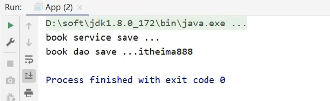

# Spring 笔记

# 1. Spring系统架构

Spring Framework 是 Spring 家族中其他框架的底层基础，学好 Spring 可以为其他 Spring 框架的学习打好基础。

## 1.1 系统架构


(1) 核心层

  * Core Container: 核心容器，这个模块是 Spring 最核心的模块，其他的都需要依赖该模块

  (2) AOP层

  * AOP: 面向切面编程，它依赖核心层容器，目的是：在不改变原有代码的前提下对其进行功能增强
  * Aspects: AOP 是思想，Aspects 是对 AOP 思想的具体实现

  (3) 数据层

  * Data Access: 数据访问，Spring 全家桶中有对数据访问的具体实现技术
  * Data Integration:数据集成，Spring 支持整合其他的数据层解决方案，比如Mybatis
  * Transactions: 事务，Spring 中事务管理是 Spring AOP 的一个具体实现，也是后期学习的重点内容

  (4) Web层

  * 这一层的内容将在 SpringMVC 框架具体学习

  (5) Test层

  * Spring 主要整合了 Junit 来完成单元测试和集成测试

## 1.2 Spring核心概念

### 1.2.1 IOC（Inversion of Control）

1. 什么是控制反转呢？

   使用对象时，由主动 new 产生对象转换为由外部提供对象，此过程中对象创建控制权由程序转移到外部，此思想称为控制反转。

   * 业务层要用数据层的类对象，以前是自己`new`的

   * 现在自己不new了，交给`别人[外部]`来创建对象

   * `别人[外部]`就反转控制了数据层对象的创建权

   * 这种思想就是控制反转

2. Spring 和 IOC 之间的关系是什么呢?
   * Spring 技术对 IOC 思想进行了实现
   * Spring 提供了一个容器，称为 **IOC 容器**，用来充当 IOC 思想中的"外部"
   * IOC 思想中的`别人[外部]`指的就是 Spring 的 IOC 容器

3. IOC容器的作用以及内部存放的是什么?
   * IOC 容器负责对象的创建、初始化等一系列工作，其中包含了数据层和业务层的类对象
   * 被创建或被管理的对象在 IOC 容器中统称为 **Bean**
   * IOC 容器中放的就是一个个的 Bean 对象

4. 当 IOC 容器中创建好 service 和 dao 对象后，程序能正确执行么?

   * 不行，因为 service 运行需要依赖 dao 对象
   * IOC 容器中虽然有 service 和 dao 对象
   * 但是 service 对象和 dao 对象没有任何关系
   * 需要把 dao 对象交给 service， 也就是说要绑定 service 和 dao 对象之间的关系

   像这种在容器中建立对象与对象之间的绑定关系就要用到 DI :

### 1.2.2 DI（Dependency Injection）

1. 什么是依赖注入呢?

   在容器中建立 bean 与 bean 之间的依赖关系的整个过程，称为依赖注入

   * 业务层要用数据层的类对象，以前是自己 `new` 的

   * 现在自己不 new 了，靠  `别人[外部其实指的就是IOC容器]` 来给注入进来

   * 这种思想就是依赖注入

2. IOC 容器中哪些 bean 之间要建立依赖关系呢?

   * 这个需要程序员根据业务需求提前建立好关系，如业务层需要依赖数据层， service 就要和 dao 建立依赖关系

   介绍完 Spring 的IOC 和 DI 的概念后，我们会发现这两个概念的最终目标就是: ==充分解耦==，具体实现靠:

   * 使用 IOC 容器管理 bean（IOC)

   * 在 IOC 容器内将有依赖关系的 bean 进行关系绑定（DI）

   * 最终结果为：使用对象时不仅可以直接从 IOC 容器中获取，并且获取到的 bean 已经绑定了所有的依赖关系

3. 为什么bean默认为单例?

   * bean为单例的意思是在Spring的IOC容器中只会有该类的一个对象

   * bean对象只有一个就避免了对象的频繁创建与销毁，达到了bean对象的复用，性能高

4. bean在容器中是单例的，会不会产生线程安全问题?

   * 如果对象是有状态对象，即该对象有成员变量可以用来存储数据的，

   * 因为所有请求线程共用一个bean对象，所以会存在线程安全问题。

   * 如果对象是无状态对象，即该对象没有成员变量没有进行数据存储的，

   * 因方法中的局部变量在方法调用完成后会被销毁，所以不会存在线程安全问题。

5. 哪些bean对象适合交给容器进行管理?

   * 表现层对象

   * 业务层对象

   * 数据层对象

   * 工具对象

6. 哪些bean对象不适合交给容器进行管理?
   * 封装实例的域对象，因为会引发线程安全问题，所以不适合。

### 1.2.3 注解开发

对于@Component注解，还衍生出了其他三个注解`@Controller`、`@Service`、`@Repository`

这三个注解和@Component注解的作用是一样的，为什么要衍生出这三个呢?

- 方便我们后期在编写类的时候能很好的区分出这个类是属于`表现层`、`业务层`还是`数据层`的类。

#### Bean的作用范围

1. 先运行App类,在控制台打印两个一摸一样的地址，说明默认情况下bean是单例

2. 要想将BookDaoImpl变成非单例，只需要在其类上添加`@scope`注解

| 名称 | @Scope                                                       |
| ---- | ------------------------------------------------------------ |
| 类型 | 类注解                                                       |
| 位置 | 类定义上方                                                   |
| 作用 | 设置该类创建对象的作用范围<br/>可用于设置创建出的bean是否为单例对象 |
| 属性 | value（默认）：定义bean作用范围，<br/>==默认值singleton（单例），可选值prototype（非单例）== |

#### Bean的生命周期

如何对方法进行标识，哪个是初始化方法，哪个是销毁方法?

- 只需要在对应的方法上添加`@PostConstruct`和`@PreDestroy`注解即可。

```java
@Repository
public class BookDaoImpl implements BookDao {
    public void save() {
        System.out.println("book dao save ...");
    }
    @PostConstruct //在构造方法之后执行，替换 init-method
    public void init() {
        System.out.println("init ...");
    }
    @PreDestroy //在销毁方法之前执行,替换 destroy-method
    public void destroy() {
        System.out.println("destroy ...");
    }
}
```

## 1.3 注解开发依赖注入

Spring为了使用注解简化开发，并没有提供`构造函数注入`、`setter注入`对应的注解，只提供了自动装配的注解实现。

注意：自动装配建议使用无参构造方法创建对象（默认），如果不提供对应构造方法，请提供唯一的构造方法。

### 1.3.1 注解实现按照类型注入

1. 在 BookServiceImpl类的bookDao属性上添加`@Autowired`注解

```java
@Service
public class BookServiceImpl implements BookService {
    @Autowired
    private BookDao bookDao;
    
//	  public void setBookDao(BookDao bookDao) {
//        this.bookDao = bookDao;
//    }
    public void save() {
        System.out.println("book service save ...");
        bookDao.save();
    }
}
```

**注意:**

* @Autowired 可以写在属性上，也可也写在 setter 方法上，最简单的处理方式是`写在属性上并将setter方法删除掉`
* 为什么 setter 方法可以删除呢?
  * 自动装配基于反射设计创建对象并通过暴力反射为私有属性进行设值
  * 普通反射只能获取 public 修饰的内容
  * 暴力反射除了获取 public 修饰的内容还可以获取 private 修改的内容
  * 所以此处无需提供 setter 方法

2. @Autowired 是按照类型注入，那么对应 BookDao 接口如果有多个实现类，比如添加 BookDaoImpl2

   此时就可以注入成功，但是得思考个问题: 

   * @Autowired 是按照类型注入的，给 BookDao 的两个实现起了名称，它还是有两个 bean 对象，为什么不报错?


   * @Autowired 默认按照类型自动装配，如果 IOC 容器中同类的 Bean 找到多个，就按照变量名和 Bean 的名称匹配。因为变量名叫 `bookDao` 而容器中也有一个 `bookDao `，所以可以成功注入。


   * 分析下面这种情况是否能完成注入呢?

     


   * 不行，因为按照类型会找到多个 bean 对象，此时会按照 `bookDao` 名称去找，因为 IOC 容器只有名称叫`bookDao1` 和 `bookDao2` ，所以找不到，会报 `NoUniqueBeanDefinitionException` 

### 1.3.2 注解实现按照名称注入

当根据类型在容器中找到多个 bean ，注入参数的属性名又和容器中 bean 的名称不一致，这个时候该如何解决，就需要使用到 `@Qualifier `来指定注入哪个名称的 bean 对象。

```java
@Service
public class BookServiceImpl implements BookService {
    @Autowired
    @Qualifier("bookDao1")
    private BookDao bookDao;
    
    public void save() {
        System.out.println("book service save ...");
        bookDao.save();
    }
}
```

@Qualifier 注解后的值就是需要注入的 bean 的名称。

==注意: @Qualifier 不能独立使用，必须和 @Autowired 一起使用==

### 1.3.3 简单数据类型注入

数据类型换了，对应的注解也要跟着换，这次使用 `@Value` 注解，将值写入注解的参数中就行了

```java
@Repository("bookDao")
public class BookDaoImpl implements BookDao {
    @Value("itheima")
    private String name;
    public void save() {
        System.out.println("book dao save ..." + name);
    }
}
```

注意数据格式要匹配，如将 "abc" 注入给 int 值，这样程序就会报错。

### 1.3.4 注解读取 properties 配置文件

`@Value` 一般会被用在从 properties 配置文件中读取内容进行使用，具体如何实现?

**步骤1：resource 下准备 properties 文件**

jdbc.properties

```properties
name=itheima888
```

**步骤2: 使用注解加载 properties 配置文件**

在配置类上添加 `@PropertySource `注解

```java
@Configuration
@ComponentScan("com.itheima")
@PropertySource("jdbc.properties")
public class SpringConfig {
}
```

**步骤3：使用 @Value 读取配置文件中的内容**

```java
@Repository("bookDao")
public class BookDaoImpl implements BookDao {
    @Value("${name}")
    private String name;
    public void save() {
        System.out.println("book dao save ..." + name);
    }
}
```

**步骤4:运行程序**

运行 App 类，查看运行结果，说明配置文件中的内容已经被加载到



**注意:**

* 如果读取的 properties 配置文件有多个，可以使用 `@PropertySource` 的属性来指定多个

  ```java
  @PropertySource({"jdbc.properties","xxx.properties"})
  ```

* `@PropertySource` 注解属性中不支持使用通配符 `*`，运行会报错

  ```java
  @PropertySource({"*.properties"})
  ```

* `@PropertySource` 注解属性中可以把 `classpath:` 加上,代表从当前项目的根路径找文件

  ```java
  @PropertySource({"classpath:jdbc.properties"})
  ```

#### 知识点1：@Autowired


| 名称 | @Autowired                                                   |
| ---- | ------------------------------------------------------------ |
| 类型 | 属性注解  或  方法注解（了解）  或  方法形参注解（了解）     |
| 位置 | 属性定义上方  或  标准 set 方法上方  或  类 set 方法上方  或  方法形参前面 |
| 作用 | 为引用类型属性设置值                                         |
| 属性 | required：true/false，定义该属性是否允许为 null              |

#### 知识点2：@Qualifier

| 名称 | @Qualifier                                               |
| ---- | -------------------------------------------------------- |
| 类型 | 属性注解  或  方法注解（了解）                           |
| 位置 | 属性定义上方  或  标准 set 方法上方  或  类 set 方法上方 |
| 作用 | 为引用类型属性指定注入的 beanId                          |
| 属性 | value（默认）：设置注入的 beanId                         |

#### 知识点3：@Value

| 名称 | @Value                                                   |
| ---- | -------------------------------------------------------- |
| 类型 | 属性注解  或  方法注解（了解）                           |
| 位置 | 属性定义上方  或  标准 set 方法上方  或  类 set 方法上方 |
| 作用 | 为  基本数据类型  或  字符串类型  属性设置值             |
| 属性 | value（默认）：要注入的属性值                            |

#### 知识点4：@PropertySource

| 名称 | @PropertySource                                              |
| ---- | ------------------------------------------------------------ |
| 类型 | 类注解                                                       |
| 位置 | 类定义上方                                                   |
| 作用 | 加载 properties 文件中的属性值                               |
| 属性 | value（默认）：设置加载的 properties 文件对应的文件名或文件名组成的数组 |

## 1.4 IOC/DI 注解开发管理第三方 bean

前面定义 bean 的时候都是在自己开发的类上面写个注解就完成了，但如果是第三方的类，这些类都是在 jar 包中，我们没有办法在类上面添加注解，这个时候该怎么办?

遇到上述问题，我们就需要有一种更加灵活的方式来定义 bean ，这种方式不能在原始代码上面书写注解，一样能定义 bean， 这就用到了一个全新的注解 ==@Bean==。

### 1.4.1 注解开发管理第三方 bean

**步骤1: 在配置类中添加一个方法**

注意该方法的返回值就是要创建的 Bean 对象类型

```java
@Configuration
public class SpringConfig {
    public DataSource dataSource(){
        DruidDataSource ds = new DruidDataSource();
        ds.setDriverClassName("com.mysql.jdbc.Driver");
        ds.setUrl("jdbc:mysql://localhost:3306/spring_db");
        ds.setUsername("root");
        ds.setPassword("root");
        return ds;
    }
}
```

**步骤2: 在方法上添加 `@Bean` 注解**

@Bean 注解的作用是将方法的返回值制作为 Spring 管理的一个 bean 对象

```java
@Configuration
public class SpringConfig {
	@Bean
    public DataSource dataSource(){
        DruidDataSource ds = new DruidDataSource();
        ds.setDriverClassName("com.mysql.jdbc.Driver");
        ds.setUrl("jdbc:mysql://localhost:3306/spring_db");
        ds.setUsername("root");
        ds.setPassword("root");
        return ds;
    }
}
```

- **注意:不能使用 `DataSource ds = new DruidDataSource()` ** 因为DataSource 接口中没有对应的 setter 方法来设置属性。

- 如果有多个 bean 要被 Spring 管理，直接在配置类中多些几个方法，方法上添加 @Bean 注解即可。

**知识点1：@Bean**

| 名称 | @Bean                                  |
| ---- | -------------------------------------- |
| 类型 | 方法注解                               |
| 位置 | 方法定义上方                           |
| 作用 | 设置该方法的返回值作为spring管理的bean |
| 属性 | value（默认）：定义bean的id            |

**知识点2：@Import**

| 名称 | @Import                                                      |
| ---- | ------------------------------------------------------------ |
| 类型 | 类注解                                                       |
| 位置 | 类定义上方                                                   |
| 作用 | 导入配置类                                                   |
| 属性 | value（默认）：定义导入的配置类类名，<br/>当配置类有多个时使用数组格式一次性导入多个配置类 |

### 1.4.2 注解开发实现为第三方 bean 注入资源

这些资源会有两大类，分别是`简单数据类型` 和`引用数据类型`。

#### 简单数据类型

方法形参

取到 jdbc.properties 配置文件，大家思考下该如何实现?

> 1.resources 目录下添加 jdbc.properties
>
> 2.配置文件中提供四个键值对分别是数据库的四要素
>
> 3.使用 @PropertySource 加载 jdbc.properties 配置文件
>
> 4.修改 @Value 注解属性的值，将其修改为 `${key}` ，key 就是键值对中的键的值

#### 引用数据类型

成员变量

**步骤1:在SpringConfig 中扫描 BookDao**

扫描的目的是让 Spring 能管理到 BookDao ，也就是说要让 IOC 容器中有一个 bookDao 对象

```java
@Configuration
@ComponentScan("com.itheima.dao")
@Import({JdbcConfig.class})
public class SpringConfig {
}
```

**步骤2:在 JdbcConfig 类的方法上添加参数**

```java
@Bean
public DataSource dataSource(BookDao bookDao){
    System.out.println(bookDao);
    DruidDataSource ds = new DruidDataSource();
    ds.setDriverClassName(driver);
    ds.setUrl(url);
    ds.setUsername(userName);
    ds.setPassword(password);
    return ds;
}
```

==引用类型注入只需要为 bean 定义方法设置形参即可，容器会根据类型自动装配对象。==

### 1.4.3 注解开发总结


# 2. Spring 整合

Spring 有一个容器，叫做 IoC 容器，里面保存 bean。在进行企业级开发的时候，其实除了将自己写的类让 Spring 管理之外，还有一部分重要的工作就是使用第三方的技术。前面已经讲了如何管理第三方 bean 了，下面结合 IoC 和 DI， 整合 2 个常用技术，进一步加深对 Spring 的使用理解。

## 2.1  Spring 整合 Mybatis 思路分析

Spring 与 Mybatis 的整合，大体需要做两件事：

第一件事是: Spring 要管理 MyBatis 中的 SqlSessionFactory

第二件事是: Spring 要管理 Mapper 接口的扫描

**步骤 1 : 项目中导入整合需要的 jar 包**

```xml
<dependency>
    <!--Spring操作数据库需要该jar包-->
    <groupId>org.springframework</groupId>
    <artifactId>spring-jdbc</artifactId>
    <version>5.2.10.RELEASE</version>
</dependency>
<dependency>
    <!--
		Spring与Mybatis整合的jar包
		这个jar包mybatis在前面，是Mybatis提供的
	-->
    <groupId>org.mybatis</groupId>
    <artifactId>mybatis-spring</artifactId>
    <version>1.3.0</version>
    <dependency>
        <groupId>mysql</groupId>
        <artifactId>mysql-connector-java</artifactId>
        <version>5.1.47</version>
</dependency>
```

**步骤 2 : 根据表创建模型类**

```java
public class Account implements Serializable {

    private Integer id;
    private String name;
    private Double money;
	//setter...getter...toString...方法略    
}
```

**步骤 4 : 创建 Dao 接口**

```java
public interface AccountDao {

    @Insert("insert into tbl_account(name,money)values(#{name},#{money})")
    void save(Account account);

    @Delete("delete from tbl_account where id = #{id} ")
    void delete(Integer id);

    @Update("update tbl_account set name = #{name} , money = #{money} where id = #{id} ")
    void update(Account account);

    @Select("select * from tbl_account")
    List<Account> findAll();

    @Select("select * from tbl_account where id = #{id} ")
    Account findById(Integer id);
}
```

**步骤 5 : 创建 Service 接口和实现类**

```java
public interface AccountService {

    void save(Account account);

    void delete(Integer id);

    void update(Account account);

    List<Account> findAll();

    Account findById(Integer id);

}

@Service
public class AccountServiceImpl implements AccountService {

    @Autowired
    private AccountDao accountDao;

    public void save(Account account) {
        accountDao.save(account);
    }

    public void update(Account account){
        accountDao.update(account);
    }

    public void delete(Integer id) {
        accountDao.delete(id);
    }

    public Account findById(Integer id) {
        return accountDao.findById(id);
    }

    public List<Account> findAll() {
        return accountDao.findAll();
    }
}
```

**步骤 6 : 添加 jdbc.properties 文件**

resources 目录下添加，用于配置数据库连接四要素

```properties
jdbc.driver=com.mysql.jdbc.Driver
jdbc.url=jdbc:mysql://localhost:3306/spring_db?useSSL=false
jdbc.username=root
jdbc.password=root
```

useSSL : 关闭 MySQL 的 SSL 连接

**步骤 7 : 创建数据源的配置类**

在配置类中完成数据源的创建

```java
public class JdbcConfig {
    @Value("${jdbc.driver}")
    private String driver;
    @Value("${jdbc.url}")
    private String url;
    @Value("${jdbc.username}")
    private String userName;
    @Value("${jdbc.password}")
    private String password;

    @Bean
    public DataSource dataSource(){
        DruidDataSource ds = new DruidDataSource();
        ds.setDriverClassName(driver);
        ds.setUrl(url);
        ds.setUsername(userName);
        ds.setPassword(password);
        return ds;
    }
}
```

## 2.2 Spring 整合 Junit

整合 Junit 与整合 Druid 和 MyBatis 差异比较大，为什么呢？ Junit 是一个搞单元测试用的工具，它不是我们程序的主体，也不会参加最终程序的运行，从作用上来说就和之前的东西不一样，它不是做功能的，看做是一个辅助工具就可以了。

**步骤1:引入依赖**

pom.xml

```xml
<dependency>
    <groupId>junit</groupId>
    <artifactId>junit</artifactId>
    <version>4.12</version>
    <scope>test</scope>
</dependency>

<dependency>
    <groupId>org.springframework</groupId>
    <artifactId>spring-test</artifactId>
    <version>5.2.10.RELEASE</version>
</dependency>
```

# 3. AOP 功能与介绍

## 3.1 AOP 简介


